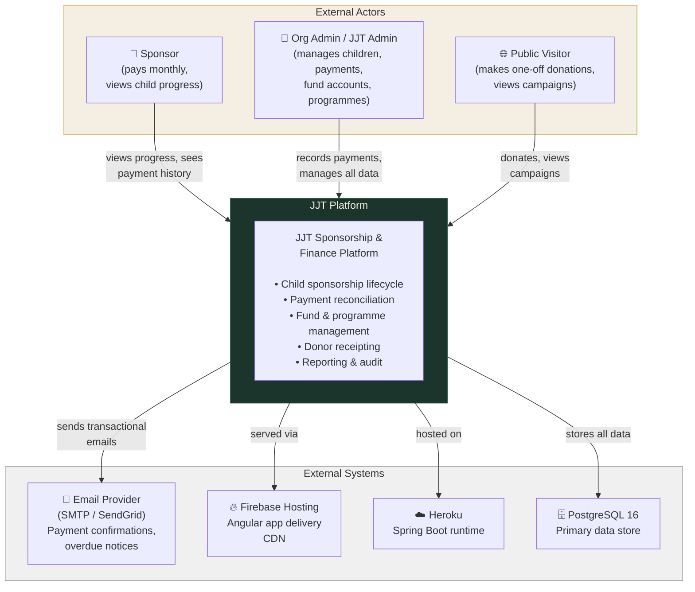
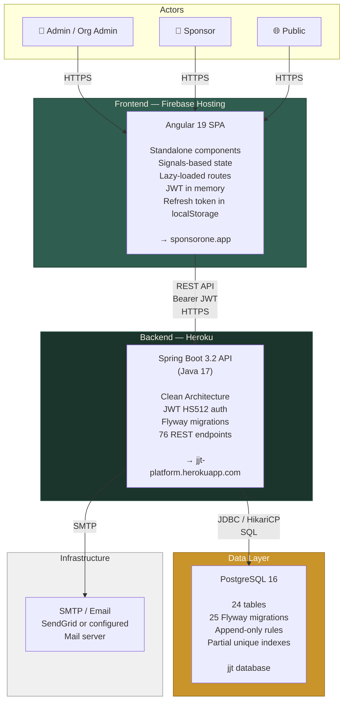
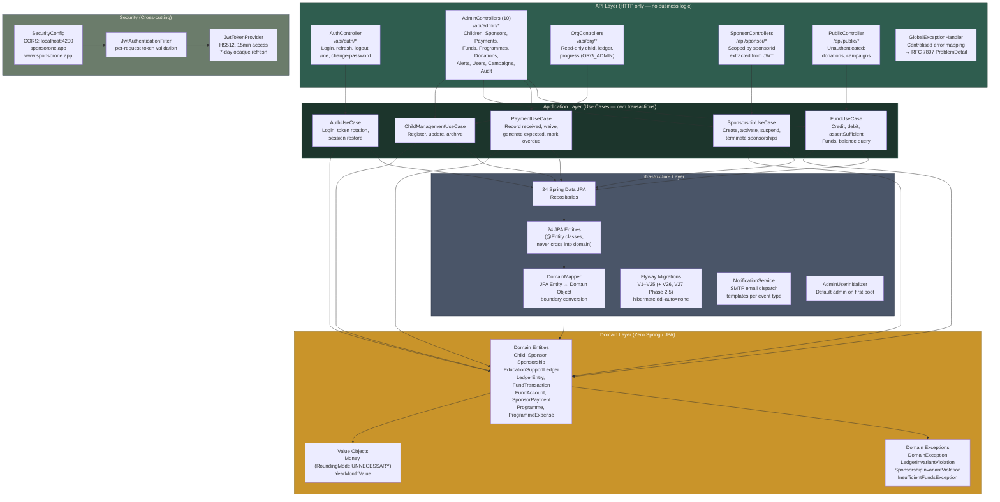
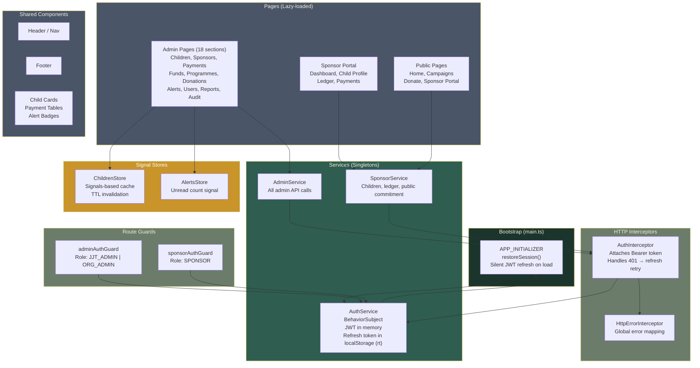
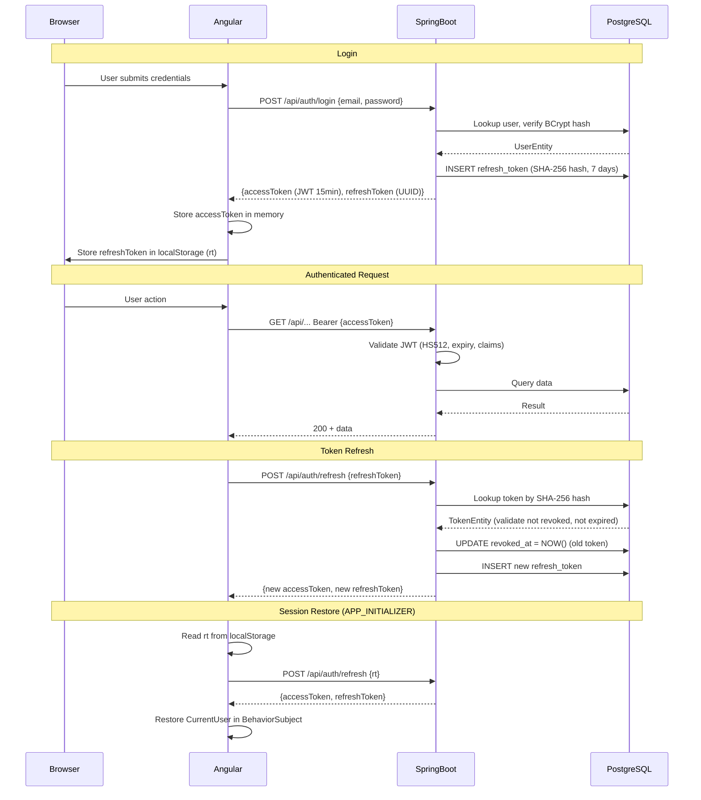
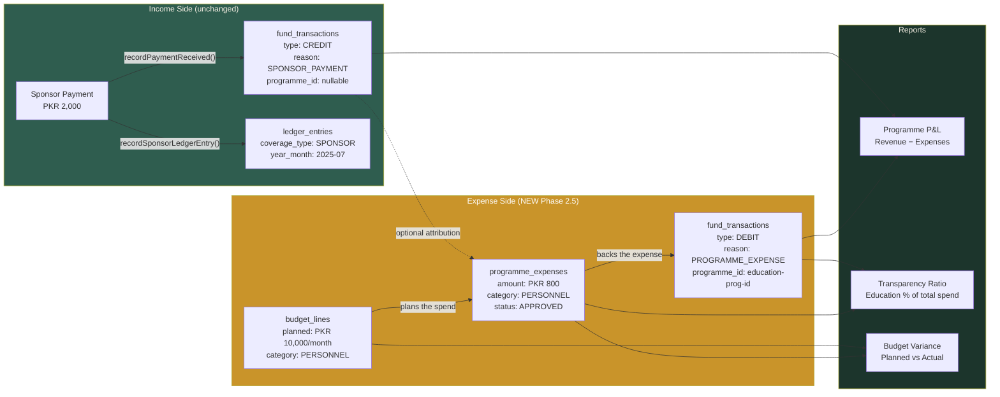

# JJT Platform — C4 Architecture Diagrams

> C4 model: Level 1 (System Context), Level 2 (Container), Level 3 (Component).
> Architecture frozen 2026-07-11.

---

## Level 1 — System Context

Who uses the system and what external systems does it touch?

---

## Level 2 — Container Diagram

What are the deployable units and how do they communicate?

---

## Level 3 — Backend Component Diagram

How are the Spring Boot components structured internally?

---

## Level 3 — Frontend Component Diagram

---

## Authentication Flow

---

## Finance Engine Data Flow (Phase 2.5)

