# JJT Platform — Complete Knowledge Base
## Junior Jinnah Trust · Technical Bible & Operational Handbook

| | |
|---|---|
| **Version** | 1.0 |
| **Prepared** | 2026-07-02 |
| **Status** | Final — Knowledge Transfer |
| **Audience** | Developers, Architects, DevOps, QA, Product, Operations |

---

# Table of Contents

- [Part 1 — Executive Overview](#part-1--executive-overview)
- [Part 2 — Business Domain](#part-2--business-domain)
- [Part 3 — Functional Specification](#part-3--functional-specification)
- [Part 4 — System Architecture](#part-4--system-architecture)
- [Part 5 — Database Bible](#part-5--database-bible)
- [Part 6 — API Reference](#part-6--api-reference)
- [Part 7 — Frontend Guide](#part-7--frontend-guide)
- [Part 8 — User Manual](#part-8--user-manual)
- [Part 9 — DevOps Handbook](#part-9--devops-handbook)
- [Part 10 — Security Handbook](#part-10--security-handbook)
- [Part 11 — Testing Strategy](#part-11--testing-strategy)
- [Part 12 — Product Roadmap](#part-12--product-roadmap)
- [Part 13 — AI Integration](#part-13--ai-integration)
- [Part 14 — Lessons Learned](#part-14--lessons-learned)
- [Part 15 — New Developer Onboarding](#part-15--new-developer-onboarding)
- [Part 16 — Glossary](#part-16--glossary)
- [Part 17 — Appendices](#part-17--appendices)

---

# Part 1 — Executive Overview

## 1.1 What Is JJT?

Junior Jinnah Trust (JJT) is a Pakistani educational charity that funds the monthly schooling costs of children who cannot afford private education. The Trust identifies children in need, enrolls them, finds sponsors (individuals or organisations willing to commit a fixed monthly amount), and manages the financial lifecycle of each sponsorship from commitment through to payment reconciliation.

The platform is the operational system that replaced manual spreadsheets. Its production domain is **sponsorone.app**.

## 1.2 Mission

To ensure that every enrolled child has an uninterrupted, accountable source of funding for their education — and that every sponsor can see exactly where their money goes.

## 1.3 Vision

A fully automated trust where agents handle recurring administrative work (payment generation, reconciliation, progress collection, board reporting) so the human team focuses entirely on field operations and sponsor relationships.

## 1.4 Business Objectives

| Objective | Metric |
|---|---|
| Financial accountability | Every PKR in and out is traceable to a person, a child, and a date |
| Sponsor confidence | Every active sponsor can log in and see their child's ledger and progress |
| Operational scale | Support 500+ children without adding headcount |
| Audit readiness | Complete, immutable financial records exportable for annual audit |
| Fund solvency | Real-time fund balance with low-reserve alerts |

## 1.5 Why This Platform Exists

Before the platform, JJT operations ran on:
- Google Sheets for child and sponsor lists
- WhatsApp for payment confirmations
- Manual Word documents for progress reports
- Zero financial audit trail

The problems this creates at scale:
1. No single source of truth — multiple spreadsheets diverge
2. Duplicate sponsors created when the same person contacts JJT twice
3. No fund balance tracking — impossible to know if the charity can cover next month
4. Sponsor has no self-service access — every query requires a staff response
5. Progress reports typed manually into WhatsApp, lost after 90 days
6. No reconciliation — payments received in a bank account never linked to specific sponsorships

## 1.6 Phase Maturity

| Phase | Status | Summary |
|---|---|---|
| Phase 1 | Complete | Core data model, admin CRUD, sponsor portal, public website |
| Phase 2 | Complete | Fund accounting, payment reconciliation, donations, campaigns, notifications, audit log |
| Phase 3 | Planned | Autonomous agents — monthly cycle, reconciliation, communication, risk detection, board reports |

## 1.7 Phase 1 Accomplishments

- Child enrollment with roll number, city, campus, education cost
- Education support ledger (append-only, one entry per child per month)
- Sponsor management with deduplication
- Sponsorship lifecycle: PENDING → ACTIVE → EXPIRED
- Coverage types: EARLY_SUPPORT (org-funded) and SPONSOR (sponsor-funded)
- Progress updates (one per child per month)
- JWT authentication with refresh token rotation
- Role-based access: JJT_ADMIN, ORG_ADMIN, SPONSOR
- Public website for browsing available children
- Public sponsorship commitment form (no login required)
- Sponsor portal — logged-in sponsor views their children's ledger and progress
- Excel bulk import for children
- Excel export for data analysis

## 1.8 Phase 2 Accomplishments

- **Fund accounting**: General Education Fund with append-only transactions; real-time balance; auto-debit on early support; minimum reserve alert
- **Payment reconciliation**: Monthly EXPECTED payment records per sponsorship; admin records received payments; auto-OVERDUE transition; waive with reason
- **Organisations table**: Multi-org foundation with JJT-001 backfill; all data scoped by org_id
- **Donations module**: Donors, donations with 6 types, recurring schedules, sequential receipt numbers
- **Notifications**: Email via SMTP (5 templates) with delivery log; enabled/disabled toggle
- **Admin alerts**: In-app alerts for PAYMENT_OVERDUE, FUND_BELOW_RESERVE, SPONSORSHIP_AT_RISK
- **Campaigns**: Lifecycle DRAFT → ACTIVE → FUNDED → CLOSED → ARCHIVED; linked to fund accounts
- **Audit log**: Immutable audit_events table; all financial actions recorded
- **Scheduled jobs**: Monthly payment generation, daily OVERDUE transition, recurring donation generation
- **Reports**: Cash flow report (up to 12 months), portfolio report
- **Exports**: Excel (children, donations, reconciliation), PDF (per-child report)
- **User management**: Admin creates SPONSOR and ORG_ADMIN users; activate/deactivate

## 1.9 Long-Term Roadmap

```
Phase 1 (Complete)  → Structured data replaces spreadsheets
Phase 2 (Complete)  → Financial accounting replaces untracked commitments
Phase 3 (Planned)   → Agents replace recurring manual work
Phase 4 (Future)    → Donor-facing portal, mobile app, GCP migration
```

---

# Part 2 — Business Domain

## 2.1 Core Concepts

### Child
A child is a student whose monthly education fee is funded by JJT. Each child has:
- A unique roll number (immutable identifier within the campus)
- A city, campus name, and optional school name
- A fixed monthly education cost (currently PKR, typically 2000 PKR/month)
- An education support ledger — the financial record of every month funded

A child's **availability status** is not stored — it is derived from their sponsorships at query time:
- `AVAILABLE` — no ACTIVE or PENDING sponsorship
- `RESERVED` — has a PENDING sponsorship (committed, payment not yet received)
- `ALLOCATED` — has an ACTIVE sponsorship (payment confirmed received)

### Sponsor
An individual or organisation that commits to paying a fixed monthly amount for a child. Sponsors have:
- A display name
- A contact email (unique — enforced by partial index)
- An optional phone number

Sponsors may or may not have a login account. A user with `SPONSOR` role is linked to exactly one sponsor record via `sponsor_id` in the JWT.

### Sponsorship
The formal relationship between a sponsor and a child. One sponsor can sponsor multiple children; one child can have at most one non-terminal (ACTIVE or PENDING) sponsorship at any time (enforced by DB partial unique index).

**Lifecycle:**

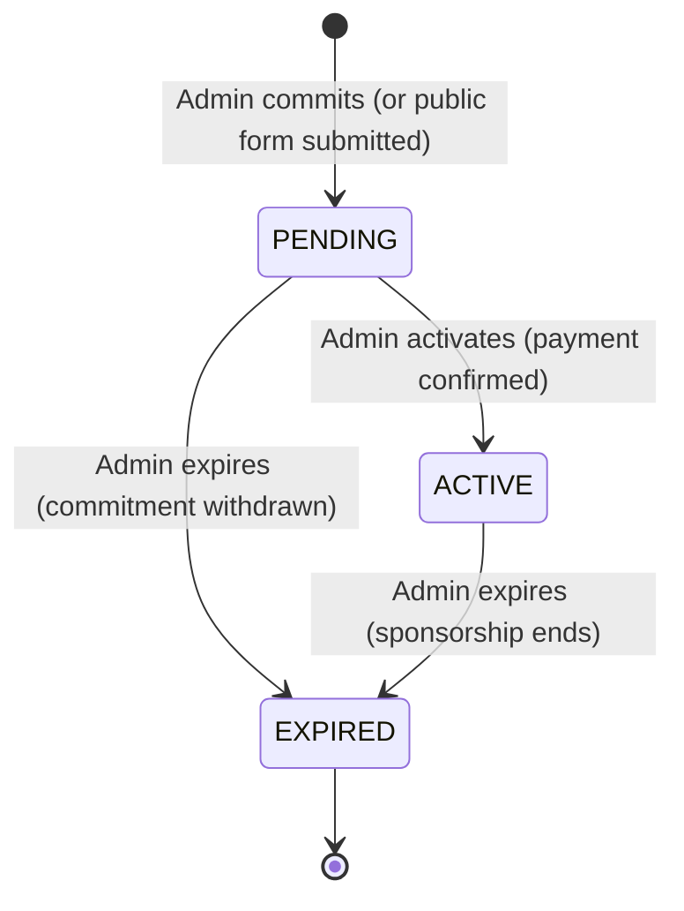

### Education Support Ledger
Every child has exactly one ledger. The ledger is an ordered, append-only collection of ledger entries — one per month. It is the canonical record of every month the child's education was funded. No entry can ever be updated or deleted (enforced at both the application level and the database level via PostgreSQL RULES).

### Ledger Entry
One row per child per month. Fields:
- `entry_month` — YYYY-MM format (e.g. `2026-07`)
- `education_amount` + `education_currency` — what was paid that month
- `coverage_type` — `EARLY_SUPPORT` (org general fund paid) or `SPONSOR` (a sponsor's payment covered this month)
- `created_by` / `created_at` — who created it and when (nullable for Phase 1 historical rows)

### Progress Update
A qualitative monthly report on a child's educational progress. One per child per month, written by field staff or admin. Sponsors can read these through the sponsor portal.

### Fund Account
A named financial account (e.g. "JJT General Education Fund"). The balance is computed dynamically by summing all transactions (never stored as a field). JJT starts with one fund account seeded on first boot.

### Fund Transaction
An append-only credit or debit against a fund account. Transaction types: `CREDIT`, `DEBIT`. Every EARLY_SUPPORT ledger entry automatically triggers a DEBIT. Manual donations trigger a CREDIT.

### Donor
An individual or organisation that makes a financial donation. Donors are distinct from Sponsors — a donor gives to the general fund or a campaign; a sponsor funds a specific child.

### Donation
A single incoming payment recorded against a fund account. Six types: `GENERAL`, `ZAKAT`, `SADAQAH`, `SPONSORSHIP_TOP_UP`, `CORPORATE`, `IN_KIND`. Each donation generates a sequential receipt number (`JJT-2026-0001`).

### Sponsor Payment
One row per sponsorship × payment month. Created monthly by the scheduler. Tracks the full lifecycle of a single month's expected payment from a sponsor. Statuses: `EXPECTED`, `RECEIVED`, `PARTIAL`, `OVERDUE`, `WAIVED`, `PREPAID`.

### Organisation
The multi-tenancy container. JJT operates as a single organisation (`slug=jjt`). All business entities carry an `organisation_id`. The multi-org infrastructure is built and backfilled — it allows a future second organisation to be added without any schema change.

### Campaign
A time-bounded fundraising initiative with an optional target amount. Status lifecycle: `DRAFT` → `ACTIVE` → `FUNDED` → `CLOSED` → `ARCHIVED`. Campaigns can be linked to a specific fund account.

## 2.2 Child Lifecycle

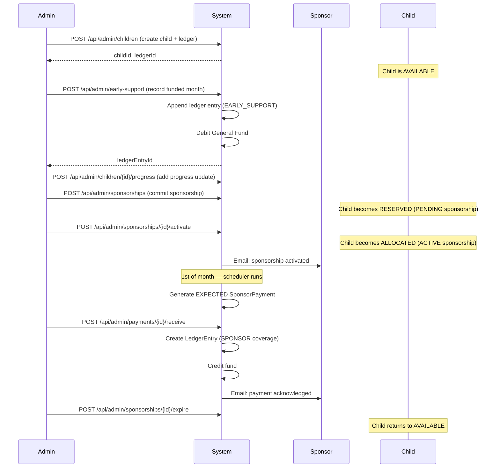

## 2.3 Sponsorship Lifecycle — Business Rules

| Rule | Enforcement |
|---|---|
| A child can have at most one ACTIVE or PENDING sponsorship | DB partial unique index `idx_one_active_pending_per_child` |
| New sponsorship start month must be in the future | Domain validation in `Sponsorship.createPending()` |
| Ledger entries cannot be updated or deleted | PostgreSQL RULE + application-level guard |
| A duplicate sponsor email shows a warning (not a hard block) | Application-level check; DB unique index prevents silent duplication |
| Fund balance below min reserve → CRITICAL alert | Checked after every DEBIT in `AdminFundService.debitForEarlySupport()` |

## 2.4 Payment Reconciliation Workflow

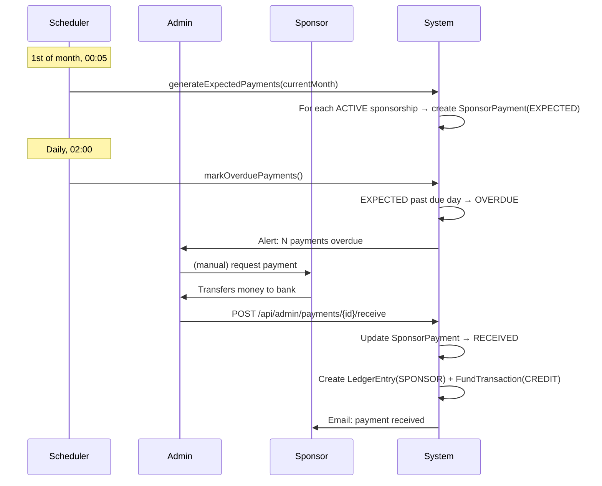

## 2.5 Fund Accounting Flow

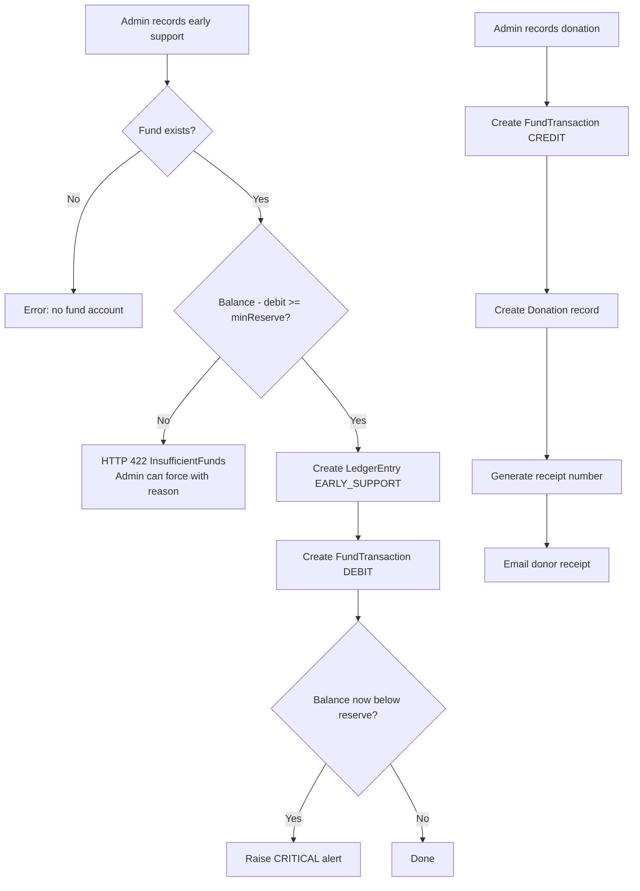

## 2.6 Business Rules Summary

| # | Rule |
|---|---|
| BR-01 | One ledger per child, created atomically with the child |
| BR-02 | One ledger entry per child per month (unique constraint) |
| BR-03 | Ledger entries are permanent — no UPDATE, no DELETE |
| BR-04 | One ACTIVE or PENDING sponsorship per child at any time |
| BR-05 | Sponsorship start month must be future when created |
| BR-06 | Fund balance is computed, never stored |
| BR-07 | Every EARLY_SUPPORT entry automatically debits the General Fund |
| BR-08 | Sponsor contact email must be unique across the organisation |
| BR-09 | Receipt numbers are sequential per org per year (JJT-YYYY-NNNN) |
| BR-10 | Audit events are written in a separate transaction — never roll back |
| BR-11 | Notifications are sent in a separate transaction — failures don't roll back payments |
| BR-12 | All data is scoped to organisation_id |
| BR-13 | Admin can override insufficient funds check with a reason (force=true) |
| BR-14 | Recurring donation schedules auto-generate EXPECTED donations daily |

---

# Part 3 — Functional Specification

## 3.1 Child Management Module

**Purpose:** Enroll children and maintain their core identity data.

**Responsibilities:**
- Create a child with a roll number (unique within org), name, city, campus, and monthly education cost
- Auto-create an education support ledger when a child is created
- Bulk import children from Excel (`.xlsx`)
- Export child data to Excel
- Generate a per-child PDF report (includes ledger history, progress updates, sponsorship history)
- List all children with their derived availability status

**Business rules:**
- Roll number must be unique (enforced by `uk_child_roll_number` DB index)
- Child and ledger are created in a single transaction
- `schoolName` is optional; all other fields are mandatory
- On bulk import: rows with missing name or campus are skipped with a reason logged; auto-generated roll numbers used if column is blank

**Permissions:**
- Create/import: `JJT_ADMIN`, `ORG_ADMIN`
- Read list and detail: `JJT_ADMIN`, `ORG_ADMIN` (authenticated), public (`/api/org/children` is open)
- Export: `JJT_ADMIN`, `ORG_ADMIN`

## 3.2 Sponsor Management Module

**Purpose:** Maintain a registry of sponsors who fund children.

**Responsibilities:**
- Create sponsors with name, email, and optional phone
- List all sponsors in the organisation
- Prevent duplicate email registration (unique index + migration V16 deduplication)
- Link sponsors to system login accounts

**Permissions:** `JJT_ADMIN`, `ORG_ADMIN`

## 3.3 Ledger Module

**Purpose:** Maintain the financial record of every funded month per child.

**Responsibilities:**
- Record early support entries (org funds a child before a sponsor is found)
- Record sponsor coverage entries (when payment received, linked ledger entry created)
- Enforce append-only semantics (no updates, no deletes)
- Check fund balance before recording early support; raise `InsufficientFundsException` if below reserve
- Expose ledger to sponsors (filtered to their children only)

**Key invariants:**
- `EducationSupportLedger.appendEntry()` is the only permitted write
- The domain object enforces this; the database enforces it redundantly with PostgreSQL RULES

## 3.4 Sponsorship Module

**Purpose:** Manage the formal commitment between sponsors and children.

**Responsibilities:**
- Create PENDING sponsorships via admin or public form
- Activate sponsorships (confirms payment commitment)
- Expire sponsorships (ends the relationship)
- List sponsorships by status or child
- Enforce one active/pending sponsorship per child

**Key design:**
- `Sponsorship.createPending()` validates future start month
- `Sponsorship.restore()` skips validation (historical rows may have past months)
- Status transitions use `Sponsorship.withStatus()` returning a new immutable instance

## 3.5 Fund Accounting Module

**Purpose:** Track the General Education Fund balance and all financial movements.

**Responsibilities:**
- Maintain one or more named fund accounts
- Compute real-time balance from transaction history
- Auto-debit fund when EARLY_SUPPORT entry created
- Allow manual credit (cash donation received)
- Alert when balance drops below minimum reserve
- Expose paginated transaction history

**Balance computation:**
```sql
SELECT COALESCE(SUM(CASE WHEN transaction_type='CREDIT' THEN amount ELSE -amount END), 0)
FROM fund_transactions
WHERE fund_account_id = :id
```

## 3.6 Payment Reconciliation Module

**Purpose:** Track monthly sponsor payments from expected to received.

**Responsibilities:**
- Generate EXPECTED payment records on the 1st of each month (scheduler)
- Allow admin to record a payment received (amount, bank reference, date)
- Auto-transition EXPECTED → OVERDUE past the configured due day (default: 15th)
- Allow admin to waive a payment with a reason
- Provide monthly reconciliation view with summary and at-risk list
- Detect consecutive overdue months and surface at-risk sponsorships

**Atomicity guarantee:**
Recording a payment atomically creates:
1. `SponsorPayment` updated to RECEIVED
2. `LedgerEntry` (SPONSOR coverage type)
3. `FundTransaction` (CREDIT)
4. `EmailNotification` queued (in a new transaction)

## 3.7 Donations Module

**Purpose:** Record all incoming financial donations with full attribution.

**Responsibilities:**
- Create and manage donors (INDIVIDUAL, CORPORATE, TRUST, ANONYMOUS)
- Record donations with type, amount, date, and optional fund routing
- Generate sequential receipt numbers per org per year
- Issue donation receipts (data structure, not PDF)
- Manage recurring donation schedules (MONTHLY, QUARTERLY, ANNUAL)
- Auto-generate EXPECTED donations from active recurring schedules (daily scheduler)
- Receive or reverse individual donations

## 3.8 Notification Module

**Purpose:** Send contextual emails to sponsors and donors.

**Responsibilities:**
- 5 email templates: PAYMENT_RECEIVED, SPONSORSHIP_ACTIVATED, PROGRESS_UPDATE, PAYMENT_OVERDUE, DONATION_RECEIPT
- Log every send attempt in `email_notifications` table
- Fail gracefully — email failure never rolls back the originating business transaction
- Feature flag `NOTIFICATIONS_ENABLED` (false by default in dev)
- SMTP-based delivery (Spring Mail)

## 3.9 Alert Module

**Purpose:** Surface operational issues requiring admin attention.

**Alert types:**
| Type | Severity | Trigger |
|---|---|---|
| PAYMENT_OVERDUE | WARNING | Sponsor payment past due day |
| FUND_BELOW_RESERVE | CRITICAL | Fund balance < min reserve after debit |
| SPONSORSHIP_AT_RISK | WARNING | 2+ consecutive overdue months |
| GENERAL | INFO | Miscellaneous |

Alerts are dismissible. Undismissed alerts shown as a count badge on the admin dashboard.

## 3.10 Audit Module

**Purpose:** Immutable record of all financial and administrative actions.

**Design:** Every significant action (child created, ledger entry added, payment received, sponsorship activated, donation recorded) writes an `audit_events` row. The service uses `Propagation.REQUIRES_NEW` so audit writes never cause the caller's transaction to roll back.

Fields: `event_type`, `actor_id`, `actor_email`, `entity_type`, `entity_id`, `description`, `metadata` (JSONB), `created_at`.

## 3.11 Campaign Module

**Purpose:** Time-bounded fundraising initiatives.

**Lifecycle:** DRAFT → ACTIVE → FUNDED → CLOSED → ARCHIVED

**Responsibilities:**
- Create campaigns with optional target amount, date range, and fund account link
- Open and close campaigns
- Public endpoint lists active campaigns (no auth required)
- Donations can reference a campaign (via `fund_account_id`)

## 3.12 User Management Module

**Purpose:** Manage login accounts for admin and sponsors.

**Responsibilities:**
- `JJT_ADMIN` creates `SPONSOR` and `ORG_ADMIN` accounts
- Activate / deactivate user accounts
- Password change via authenticated endpoint
- Session management: 15-minute access tokens, 7-day refresh tokens (server-side revocation)

## 3.13 Reporting Module

**Purpose:** Financial and operational reports for admin and board.

**Reports available:**
| Report | Endpoint | Description |
|---|---|---|
| Cash flow | `GET /api/admin/reports/cash-flow?months=6` | Monthly opening, credits, debits, closing balance for up to 12 months |
| Portfolio | `GET /api/admin/reports/portfolio` | Active/pending/expired sponsorships, monthly value, commitment breakdown |
| Monthly reconciliation | `GET /api/admin/reconciliation/monthly?year=Y&month=M` | Payment status summary + at-risk list for a given month |
| Dashboard | `GET /api/admin/dashboard` | Fund summaries, children stats, payment stats, alert count |

**Export formats:**
| Export | Endpoint | Format |
|---|---|---|
| All children | `GET /api/admin/export/children.xlsx` | Excel |
| All donations | `GET /api/admin/export/donations.xlsx` | Excel |
| Reconciliation | `GET /api/admin/export/reconciliation/{Y}/{M}.xlsx` | Excel |
| Child report | `GET /api/admin/export/children/{id}/report.pdf` | PDF |

---

# Part 4 — System Architecture

## 4.1 Architecture Style

The backend follows a **layered architecture with DDD influence**. It is not a full DDD implementation — it uses the vocabulary (entities, value objects, domain exceptions) and the key invariant (domain layer has zero framework dependencies) without applying aggregates, domain services, or event sourcing in the DDD sense.

The architecture layers are:

```
┌──────────────────────────────────────────────────┐
│  HTTP API Layer (api/)                           │
│  Controllers · DTOs · GlobalExceptionHandler     │
│  Input validation · Response mapping             │
└──────────────────────┬───────────────────────────┘
                       │
┌──────────────────────▼───────────────────────────┐
│  Application Layer (application/usecase/)        │
│  Use cases — pure Java · No Spring               │
│  Orchestrate domain objects                      │
└──────────────────────┬───────────────────────────┘
                       │
┌──────────────────────▼───────────────────────────┐
│  Domain Layer (core/domain/)                     │
│  Entities · Value Objects · Exceptions           │
│  Zero Spring · Zero JPA · Zero persistence       │
└──────────────────────────────────────────────────┘
                       │ (Mappers cross this boundary)
┌──────────────────────▼───────────────────────────┐
│  Infrastructure Layer (infrastructure/)          │
│  JPA Entities · Repositories · Mappers           │
│  Schedulers · Notifications · Audit              │
└──────────────────────────────────────────────────┘
                       │
┌──────────────────────▼───────────────────────────┐
│  PostgreSQL 16                                   │
│  Managed by Flyway migrations                    │
└──────────────────────────────────────────────────┘
```

## 4.2 Dependency Rules

| Layer | Can depend on | Cannot depend on |
|---|---|---|
| Domain | Nothing (pure Java) | Spring, JPA, any framework |
| Use cases | Domain only | JPA, Spring, HTTP |
| API | Application, Infrastructure (for reads), Domain | Database directly |
| Infrastructure | Domain, Spring, JPA | API layer |

**Why this matters:** The domain layer can be unit-tested with plain `new`. No Spring context, no database, no mocks needed. This makes domain logic tests fast and reliable.

## 4.3 Package Structure

```
com.jjt.platform
├── api/
│   ├── admin/            Admin controllers + DTOs + services
│   │   ├── AdminController.java         Sponsor/child/ledger/sponsorship write ops
│   │   ├── AdminChildController.java    Child list and detail reads
│   │   ├── AdminDashboardController.java Dashboard aggregation
│   │   ├── AdminDonationController.java  Donor + donation management
│   │   ├── AdminExportController.java   Excel and PDF downloads
│   │   ├── AdminFundController.java     Fund accounts and transactions
│   │   ├── AdminImportController.java   Bulk Excel import
│   │   ├── AdminOrgController.java      Organisation config
│   │   ├── AdminPaymentController.java  Payment recording + reconciliation
│   │   ├── AdminReportController.java   Cash flow + portfolio reports
│   │   ├── AdminAlertController.java    Alert list + dismiss
│   │   ├── AdminAuditController.java    Audit log
│   │   ├── AdminCampaignController.java Campaign CRUD
│   │   ├── UserManagementController.java User create/activate/deactivate
│   │   ├── dto/                         Request and response records
│   │   └── service/                     Business logic called by controllers
│   ├── auth/             Login, refresh, logout, me, change-password
│   ├── common/           GlobalExceptionHandler, shared DTOs, DtoMapper
│   ├── org/              Public read: children, ledger, progress (open routes)
│   ├── publics/          Unauthenticated: sponsorship commitment, campaigns
│   └── sponsor/          SPONSOR role: scoped child + ledger + progress
├── application/usecase/  Five use cases (pure Java, no Spring)
├── config/
│   └── security/         SecurityConfig, JWT infrastructure, Role enum
├── core/domain/
│   ├── entity/           Child, Sponsor, Sponsorship, EducationSupportLedger,
│   │                     LedgerEntry, ProgressUpdate, FundAccount, FundTransaction,
│   │                     Donor, Donation, SponsorPayment, Organisation,
│   │                     AdminAlert, Campaign + all enums
│   ├── exceptions/        DomainException, LedgerInvariantViolationException,
│   │                     SponsorshipInvariantViolationException, InsufficientFundsException
│   └── value/            Money, YearMonthValue
└── infrastructure/
    ├── audit/            AuditService (REQUIRES_NEW transaction)
    ├── notification/     NotificationService, EmailTemplates
    ├── persistence/
    │   ├── entity/       JPA entities (one per domain entity)
    │   ├── mapper/       Domain ↔ JPA entity converters
    │   ├── repository/   Spring Data JPA repositories
    │   └── seed/         Boot-time initializers (org, admin user, fund account)
    └── scheduler/        PaymentScheduler (@Scheduled jobs)
```

## 4.4 Use Cases

The application layer contains exactly five use cases. Each is a pure Java class instantiated directly (not Spring-managed) by `AdminCommandService`:

| Use Case | Responsibility |
|---|---|
| `CreateChildUseCase` | Validates and constructs Child + EducationSupportLedger domain objects |
| `CreateSponsorUseCase` | Constructs a Sponsor domain object |
| `RecordEarlySupportUseCase` | Appends a EARLY_SUPPORT entry to a ledger |
| `AddMonthlyProgressUseCase` | Creates a ProgressUpdate domain object |
| `CommitFutureSponsorshipUseCase` | Creates a PENDING Sponsorship |

Use cases contain zero I/O. They receive domain objects and return domain objects. Persistence is the service's responsibility.

## 4.5 Key Architectural Decisions

### Decision 1: Domain layer has zero framework dependencies
**Why:** Allows unit testing without a Spring context. Domain invariants can be verified in milliseconds. A future framework change does not require rewriting business rules.

### Decision 2: JPA entities never enter the domain or application layers
**Why:** JPA entities are mutable, have lazy-loading side effects, and carry Hibernate-specific annotations. Allowing them into use cases would couple business logic to the persistence framework. Mappers convert at the infrastructure boundary.

### Decision 3: Append-only ledger enforced at two levels
**Why:** A single enforcement point can be bypassed by a developer with database access. PostgreSQL RULES prevent UPDATE/DELETE at the database level regardless of application code. This protects the financial record even if someone connects to the database directly.

### Decision 4: Balance computed, never stored
**Why:** Storing a running balance creates a consistency risk — any bug in update logic creates a mismatch between the balance column and the actual transaction history. Computing from transactions is slower but always correct.

### Decision 5: Availability status derived, never stored
**Why:** Storing it would require updating it every time a sponsorship changes status. The derivation is simple (`EXISTS` check) and is done in-memory for list views to avoid N+1 queries.

### Decision 6: Notifications and audit in separate transactions
**Why:** If the audit write or email send fails, it must not roll back the payment record. Using `Propagation.REQUIRES_NEW` ensures the business transaction commits first; ancillary failures are logged and recoverable.

### Decision 7: Flyway owns all schema changes
**Why:** `hibernate.ddl-auto=none` everywhere. Hibernate auto-DDL is convenient but dangerous — it drops columns it doesn't recognise, it cannot express partial indexes, and it cannot enforce ordering constraints. Flyway migrations are version-controlled, reviewed, and irreversible (no accidental schema changes in production).

## 4.6 Security Architecture

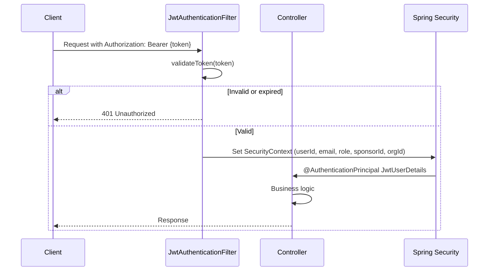

**JWT Claims:**
| Claim | Type | Description |
|---|---|---|
| `sub` | UUID | User ID |
| `email` | String | User email address |
| `role` | String | One of: JJT_ADMIN, ORG_ADMIN, SPONSOR |
| `sponsorId` | UUID (nullable) | Set only for SPONSOR role users |
| `orgId` | UUID (nullable) | Organisation the user belongs to |

**Token storage:**
- Access token: in Angular memory only (never localStorage, never cookie)
- Refresh token: `localStorage` key `rt` on Angular side; stored as SHA-256 hash server-side in `refresh_tokens` table

**Rotation:** Every `/api/auth/refresh` call revokes the old refresh token and issues a new pair atomically.

## 4.7 CORS Configuration

```java
config.setAllowedOrigins(List.of(
    "http://localhost:4200",
    "https://sponsorone.app",
    "https://www.sponsorone.app",
    "https://sandbox-27e5d.web.app",         // Firebase preview
    "https://sandbox-27e5d.firebaseapp.com"  // Firebase preview
));
config.setAllowedMethods(List.of("GET", "POST", "PUT", "PATCH", "DELETE", "OPTIONS"));
```

Adding a new allowed origin requires a code change and redeployment.

## 4.8 Exception Handling

All exceptions are handled centrally in `GlobalExceptionHandler`. No controller has its own `@ExceptionHandler`.

| Exception | HTTP Status | Error Code |
|---|---|---|
| `UnauthorizedException` | 401 | UNAUTHORIZED |
| `ForbiddenException` / `AccessDeniedException` | 403 | FORBIDDEN |
| `InsufficientFundsException` | 422 | INSUFFICIENT_FUNDS (with balance details) |
| `LedgerInvariantViolationException` | 409 | LEDGER_CONFLICT |
| `SponsorshipInvariantViolationException` | 409 | SPONSORSHIP_CONFLICT |
| `DomainException` | 400 | DOMAIN_ERROR |
| `MethodArgumentNotValidException` | 400 | VALIDATION_ERROR |
| `DataIntegrityViolationException` | 409 | CONFLICT |
| `Exception` (uncaught) | 500 | INTERNAL_ERROR |

## 4.9 Technology Stack

| Component | Technology | Version |
|---|---|---|
| Language | Java | 17 |
| Framework | Spring Boot | 3.x |
| ORM | Spring Data JPA / Hibernate | via Spring Boot BOM |
| Migrations | Flyway | via Spring Boot BOM |
| Security | Spring Security + jjwt | 0.12.6 |
| Database | PostgreSQL | 16 |
| Mail | Spring Mail (SMTP) | via Spring Boot BOM |
| Excel | Apache POI | 5.2.5 |
| PDF | OpenPDF (LibrePDF fork) | 1.3.30 |
| Testing | JUnit 5 + Testcontainers + Spring Boot Test | via Spring Boot BOM |
| Frontend | Angular | 18 (standalone components) |
| Hosting (FE) | Firebase Hosting | — |
| Hosting (BE) | Heroku | — |
| Database (prod) | Heroku PostgreSQL | Essential-0 |

---

# Part 5 — Database Bible

## 5.1 Migration History

| Migration | Name | Purpose |
|---|---|---|
| V1 | init | Core tables: children, education_support_ledgers, ledger_entries, sponsors, sponsorships, progress_updates |
| V2 | one_active_sponsorship_per_child | Unique index on child_id (incorrect — dropped in V4) |
| V3 | sponsorship_status_lifecycle | Add status, created_at, expires_at to sponsorships; sponsor phone |
| V4 | drop_active_unique_index | Drop V2's incorrect index |
| V5 | seed_postgres_test_data | Insert 10 children, 5 sponsors, test sponsorships (removed in V8) |
| V6 | add_child_identity | Add roll_number, city, campus_name, school_name to children |
| V7 | sponsorship_commitment_type | Add commitment_type (MONTHLY/YEARLY) to sponsorships |
| V8 | remove_v5_seed_test_data | Delete all V5 test data in FK-safe order |
| V9 | add_coverage_type_to_ledger_entries | Add coverage_type (EARLY_SUPPORT/SPONSOR) |
| V10 | create_users_table | Users table with role, sponsor_id FK |
| V11 | create_refresh_tokens_table | Refresh tokens stored as SHA-256 hashes |
| V12 | add_audit_columns | Add created_by + created_at to ledger_entries, progress_updates, sponsorships |
| V13 | create_organisations | organisations table; nullable organisation_id on all business tables; backfill JJT-001 |
| V14 | ledger_entries_append_only | PostgreSQL RULES preventing UPDATE/DELETE on ledger_entries |
| V15 | one_active_per_child | Partial unique index: one ACTIVE or PENDING sponsorship per child |
| V16 | unique_sponsor_email | Deduplicate sponsors by email; create unique index |
| V17 | fund_accounts | fund_accounts, fund_transactions tables (append-only rules on transactions) |
| V18 | sponsor_payments | sponsor_payments table with full payment lifecycle |
| V19 | org_scoping | Enforce NOT NULL on organisation_id everywhere; add org_id to sponsor_payments |
| V20 | donations | donors, donation_receipt_sequences, recurring_donation_schedules, donations |
| V21 | notifications | email_notifications, admin_alerts |
| V22 | campaigns | campaigns table |
| V23 | audit_log | audit_events table |

## 5.2 Entity Relationship Overview

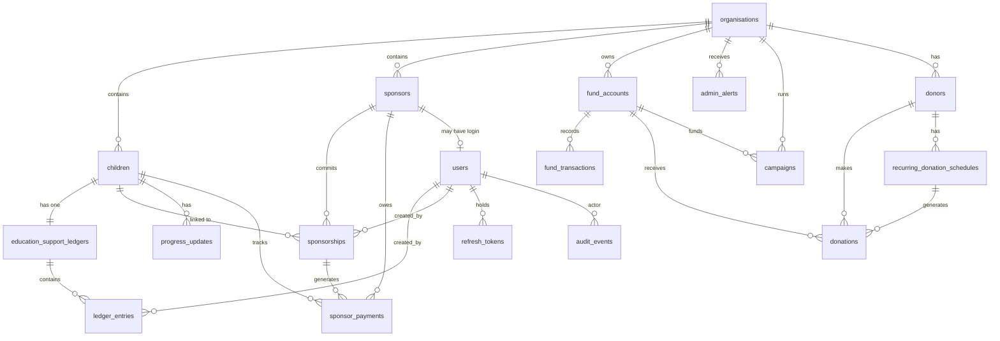

## 5.3 Table Reference

### `children`
| Column | Type | Constraints | Notes |
|---|---|---|---|
| id | UUID | PK | Client-supplied UUID |
| full_name | VARCHAR(255) | NOT NULL | |
| education_amount | NUMERIC(12,2) | NOT NULL | Monthly cost |
| education_currency | CHAR(3) | NOT NULL | ISO 4217, typically PKR |
| roll_number | VARCHAR(255) | NOT NULL, UNIQUE | Added V6 |
| city | VARCHAR(255) | NOT NULL | Added V6 |
| campus_name | VARCHAR(255) | NOT NULL | Added V6 |
| school_name | VARCHAR(255) | nullable | Added V6 |
| organisation_id | UUID | NOT NULL FK→organisations | Added V13, NOT NULL V19 |

**Indexes:** `uk_child_roll_number`, `idx_children_org_id`

### `education_support_ledgers`
| Column | Type | Constraints | Notes |
|---|---|---|---|
| id | UUID | PK | Client-supplied |
| child_id | UUID | NOT NULL UNIQUE FK→children | One ledger per child |
| organisation_id | UUID | NOT NULL FK→organisations | Added V13 |

### `ledger_entries`
| Column | Type | Constraints | Notes |
|---|---|---|---|
| id | UUID | PK | Client-supplied |
| ledger_id | UUID | NOT NULL FK→education_support_ledgers | |
| child_id | UUID | NOT NULL FK→children | Denormalized for query performance |
| entry_month | CHAR(7) | NOT NULL | YYYY-MM format |
| education_amount | NUMERIC(12,2) | NOT NULL | |
| education_currency | CHAR(3) | NOT NULL | |
| coverage_type | VARCHAR(20) | NOT NULL DEFAULT 'EARLY_SUPPORT' | Added V9 |
| created_by | UUID | nullable FK→users | Added V12 |
| created_at | TIMESTAMPTZ | NOT NULL DEFAULT NOW() | Added V12 |
| organisation_id | UUID | NOT NULL FK→organisations | Added V13 |

**Constraints:** UNIQUE `(ledger_id, entry_month)` — one entry per month per ledger

**PostgreSQL RULES (V14):**
```sql
CREATE RULE no_update_ledger_entries AS ON UPDATE TO ledger_entries DO INSTEAD NOTHING;
CREATE RULE no_delete_ledger_entries AS ON DELETE TO ledger_entries DO INSTEAD NOTHING;
```
These silently discard any UPDATE or DELETE — not an exception. A Hibernate flush that attempts to update a ledger entry will succeed in the transaction (no error thrown) but the change will not be written to disk.

### `sponsors`
| Column | Type | Constraints | Notes |
|---|---|---|---|
| id | UUID | PK | Client-supplied |
| display_name | VARCHAR(255) | NOT NULL | |
| contact_email | VARCHAR(255) | NOT NULL, UNIQUE | Unique index added V16 |
| phone | VARCHAR(64) | nullable | Added V3 |
| organisation_id | UUID | NOT NULL FK→organisations | Added V13 |

### `sponsorships`
| Column | Type | Constraints | Notes |
|---|---|---|---|
| id | UUID | PK | Client-supplied |
| sponsor_id | UUID | NOT NULL FK→sponsors | |
| child_id | UUID | NOT NULL FK→children | |
| start_month | CHAR(7) | NOT NULL | YYYY-MM |
| status | VARCHAR(16) | NOT NULL DEFAULT 'PENDING' | PENDING / ACTIVE / EXPIRED |
| created_at | TIMESTAMPTZ | NOT NULL | Added V3 |
| expires_at | TIMESTAMPTZ | nullable | |
| commitment_type | VARCHAR(20) | NOT NULL DEFAULT 'MONTHLY' | MONTHLY / YEARLY. Added V7 |
| created_by | UUID | nullable FK→users | Added V12 |
| organisation_id | UUID | NOT NULL FK→organisations | Added V13 |

**Constraints:**
- UNIQUE `(sponsor_id, child_id, start_month)`
- Partial unique index `idx_one_active_pending_per_child ON sponsorships(child_id) WHERE status IN ('ACTIVE','PENDING')` — enforces max one non-terminal sponsorship per child

### `progress_updates`
| Column | Type | Constraints | Notes |
|---|---|---|---|
| id | UUID | PK | Client-supplied |
| child_id | UUID | NOT NULL FK→children | |
| update_month | CHAR(7) | NOT NULL | YYYY-MM |
| summary | VARCHAR(2000) | NOT NULL | |
| created_by | UUID | nullable FK→users | Added V12 |
| created_at | TIMESTAMPTZ | NOT NULL DEFAULT NOW() | Added V12 |
| organisation_id | UUID | NOT NULL FK→organisations | Added V13 |

**Constraints:** UNIQUE `(child_id, update_month)`

### `users`
| Column | Type | Constraints | Notes |
|---|---|---|---|
| id | UUID | PK DEFAULT gen_random_uuid() | Server-generated |
| email | VARCHAR(255) | NOT NULL UNIQUE | |
| password_hash | VARCHAR(255) | NOT NULL | BCrypt cost 12 |
| role | VARCHAR(20) | NOT NULL | JJT_ADMIN / ORG_ADMIN / SPONSOR |
| sponsor_id | UUID | nullable FK→sponsors | Set only for SPONSOR role |
| org_id | UUID | nullable | Links user to an organisation |
| active | BOOLEAN | NOT NULL DEFAULT TRUE | Deactivated users cannot log in |
| created_at | TIMESTAMPTZ | NOT NULL DEFAULT NOW() | |
| updated_at | TIMESTAMPTZ | NOT NULL DEFAULT NOW() | |
| last_login_at | TIMESTAMPTZ | nullable | |

### `refresh_tokens`
| Column | Type | Constraints | Notes |
|---|---|---|---|
| id | UUID | PK | |
| user_id | UUID | NOT NULL FK→users ON DELETE CASCADE | |
| token_hash | VARCHAR(255) | NOT NULL UNIQUE | SHA-256 of opaque UUID token |
| issued_at | TIMESTAMPTZ | NOT NULL | |
| expires_at | TIMESTAMPTZ | NOT NULL | 7 days after issue |
| revoked_at | TIMESTAMPTZ | nullable | Set on logout or rotation |

### `organisations`
| Column | Type | Constraints | Notes |
|---|---|---|---|
| id | UUID | PK DEFAULT gen_random_uuid() | |
| name | VARCHAR(255) | NOT NULL | e.g. "Junior Jinnah Trust" |
| slug | VARCHAR(64) | NOT NULL UNIQUE | e.g. "jjt" |
| base_currency | CHAR(3) | NOT NULL DEFAULT 'PKR' | |
| payment_due_day | INT | NOT NULL DEFAULT 15 | Day of month payments are due |
| min_fund_reserve | NUMERIC(14,2) | NOT NULL DEFAULT 20000.00 | |
| active | BOOLEAN | NOT NULL DEFAULT TRUE | |
| created_at | TIMESTAMPTZ | NOT NULL | |

### `fund_accounts`
| Column | Type | Constraints | Notes |
|---|---|---|---|
| id | UUID | PK DEFAULT gen_random_uuid() | |
| name | VARCHAR(200) | NOT NULL | e.g. "JJT General Education Fund" |
| currency | CHAR(3) | NOT NULL DEFAULT 'PKR' | |
| min_reserve | NUMERIC(14,2) | NOT NULL DEFAULT 0.00 | Threshold for low-balance alert |
| organisation_id | UUID | NOT NULL FK→organisations | |
| created_by | UUID | nullable FK→users | |
| created_at | TIMESTAMPTZ | NOT NULL | |

### `fund_transactions`
| Column | Type | Constraints | Notes |
|---|---|---|---|
| id | UUID | PK DEFAULT gen_random_uuid() | |
| fund_account_id | UUID | NOT NULL FK→fund_accounts | |
| transaction_type | VARCHAR(10) | NOT NULL CHECK IN ('CREDIT','DEBIT') | |
| amount | NUMERIC(14,2) | NOT NULL CHECK > 0 | Always positive |
| currency | CHAR(3) | NOT NULL DEFAULT 'PKR' | |
| reason | VARCHAR(100) | NOT NULL | EARLY_SUPPORT / MANUAL_CREDIT / SPONSOR_PAYMENT / etc. |
| description | TEXT | nullable | |
| external_reference | VARCHAR(200) | nullable | Bank reference number |
| ledger_entry_id | UUID | nullable FK→ledger_entries | Set when linked to early support |
| created_by | UUID | nullable FK→users | |
| created_at | TIMESTAMPTZ | NOT NULL | |

**PostgreSQL RULES (V17):**
```sql
CREATE RULE no_update_fund_transactions AS ON UPDATE TO fund_transactions DO INSTEAD NOTHING;
CREATE RULE no_delete_fund_transactions AS ON DELETE TO fund_transactions DO INSTEAD NOTHING;
```

### `sponsor_payments`
| Column | Type | Constraints | Notes |
|---|---|---|---|
| id | UUID | PK DEFAULT gen_random_uuid() | |
| sponsorship_id | UUID | NOT NULL FK→sponsorships | |
| sponsor_id | UUID | NOT NULL FK→sponsors | Denormalized |
| child_id | UUID | NOT NULL FK→children | Denormalized |
| payment_month | VARCHAR(7) | NOT NULL | YYYY-MM |
| status | VARCHAR(10) | NOT NULL DEFAULT 'EXPECTED' | EXPECTED/RECEIVED/PARTIAL/OVERDUE/WAIVED/PREPAID |
| expected_amount | NUMERIC(14,2) | NOT NULL | Copied from child.education_amount at creation |
| expected_currency | CHAR(3) | NOT NULL | |
| received_amount | NUMERIC(14,2) | nullable | Set when recorded |
| received_currency | CHAR(3) | nullable | |
| bank_reference | VARCHAR(200) | nullable | |
| received_date | DATE | nullable | |
| waiver_reason | TEXT | nullable | |
| fund_transaction_id | UUID | nullable FK→fund_transactions | |
| ledger_entry_id | UUID | nullable FK→ledger_entries | |
| organisation_id | UUID | NOT NULL FK→organisations | |
| created_by / updated_by | UUID | nullable FK→users | |
| created_at / updated_at | TIMESTAMPTZ | NOT NULL | |

**Constraint:** UNIQUE `(sponsorship_id, payment_month)`

### `donors`
| Column | Type | Notes |
|---|---|---|
| id | UUID PK | |
| organisation_id | UUID NOT NULL | |
| display_name | VARCHAR(255) NOT NULL | |
| email | VARCHAR(255) nullable | |
| phone | VARCHAR(50) nullable | |
| donor_type | VARCHAR(20) NOT NULL | INDIVIDUAL/CORPORATE/TRUST/ANONYMOUS |
| notes | TEXT nullable | |
| created_by | UUID nullable | |
| created_at | TIMESTAMPTZ NOT NULL | |

### `donations`
| Column | Type | Notes |
|---|---|---|
| id | UUID PK | |
| organisation_id | UUID NOT NULL | |
| donor_id | UUID nullable FK→donors | Anonymous donations allowed |
| donation_type | VARCHAR(30) NOT NULL | GENERAL/ZAKAT/SADAQAH/SPONSORSHIP_TOP_UP/CORPORATE/IN_KIND |
| amount | NUMERIC(14,2) NOT NULL CHECK > 0 | |
| currency | CHAR(3) NOT NULL | |
| donation_date | DATE NOT NULL | |
| receipt_number | VARCHAR(30) nullable UNIQUE | Format: JJT-2026-0001 |
| fund_account_id | UUID nullable FK→fund_accounts | |
| fund_transaction_id | UUID nullable FK→fund_transactions | |
| status | VARCHAR(20) NOT NULL | EXPECTED/RECEIPTED/REVERSED |
| recurring_schedule_id | UUID nullable | |
| created_by / updated_by | UUID nullable | |
| created_at / updated_at | TIMESTAMPTZ NOT NULL | |

### `donation_receipt_sequences`
| Column | Type | Notes |
|---|---|---|
| organisation_id | UUID | PK part 1 |
| year | INT | PK part 2 |
| last_sequence | INT NOT NULL DEFAULT 0 | Incremented on each receipt issued |

This table is locked with `SELECT FOR UPDATE` during receipt generation to prevent duplicate numbers under concurrent load.

### `recurring_donation_schedules`
Tracks monthly/quarterly/annual recurring commitments from a donor. Status: ACTIVE/PAUSED/COMPLETED/CANCELLED. The daily scheduler generates EXPECTED donation records for schedules whose `next_due_date <= today`.

### `email_notifications`
Audit log of every outbound email attempt. Status: QUEUED → SENT or FAILED. Never deleted — provides an idempotency check history.

### `admin_alerts`
Active operational alerts. Dismissed by admin. Partial index on `dismissed_at IS NULL` for fast active-alert queries.

### `campaigns`
| Column | Type | Notes |
|---|---|---|
| id | UUID PK | |
| organisation_id | UUID NOT NULL | |
| name | VARCHAR(255) NOT NULL | |
| description | TEXT nullable | |
| target_amount | NUMERIC(19,4) nullable | |
| target_currency | VARCHAR(10) NOT NULL DEFAULT 'PKR' | |
| status | VARCHAR(20) NOT NULL DEFAULT 'DRAFT' | DRAFT/ACTIVE/FUNDED/CLOSED/ARCHIVED |
| start_date / end_date | DATE nullable | |
| fund_account_id | UUID nullable | |
| created_by | UUID nullable | |
| created_at / updated_at | TIMESTAMPTZ NOT NULL | |

### `audit_events`
| Column | Type | Notes |
|---|---|---|
| id | UUID PK | |
| organisation_id | UUID NOT NULL | |
| event_type | VARCHAR(60) NOT NULL | e.g. CHILD_CREATED, PAYMENT_RECEIVED |
| actor_id | UUID nullable | |
| actor_email | VARCHAR(255) nullable | |
| entity_type | VARCHAR(50) nullable | e.g. Child, SponsorPayment |
| entity_id | UUID nullable | |
| description | TEXT NOT NULL | Human-readable description |
| metadata | JSONB nullable | Additional structured data |
| created_at | TIMESTAMPTZ NOT NULL | |

**Never modified after creation.** No UPDATE or DELETE is ever issued against this table.

## 5.4 Indexes Reference

| Index | Table | Type | Purpose |
|---|---|---|---|
| `uk_child_roll_number` | children | UNIQUE | Prevent duplicate roll numbers |
| `idx_children_org_id` | children | B-tree | Filter children by org |
| `uk_sponsor_contact_email` | sponsors | UNIQUE | Prevent duplicate sponsors |
| `idx_sponsors_org_id` | sponsors | B-tree | Filter sponsors by org |
| `idx_one_active_pending_per_child` | sponsorships | PARTIAL UNIQUE | One non-terminal sponsorship per child |
| `idx_sponsorships_org_id` | sponsorships | B-tree | Filter sponsorships by org |
| `idx_ledger_entries_org_id` | ledger_entries | B-tree | Filter entries by org |
| `idx_fund_txn_account_date` | fund_transactions | B-tree | Ordered transaction history |
| `idx_sponsor_payments_status_month` | sponsor_payments | B-tree | Reconciliation queries |
| `idx_sponsor_payments_sponsorship` | sponsor_payments | B-tree | Per-sponsorship history |
| `idx_donations_receipt` | donations | PARTIAL UNIQUE | Unique receipt numbers |
| `idx_admin_alerts_active` | admin_alerts | PARTIAL B-tree | Active alerts only (WHERE dismissed_at IS NULL) |
| `idx_audit_events_org` | audit_events | B-tree | Audit log by org and time |
| `idx_refresh_tokens_token_hash` | refresh_tokens | UNIQUE | O(1) token lookup on refresh |

---

# Part 6 — API Reference

## 6.1 Authentication Endpoints

All auth endpoints are on `/api/auth`.

### POST /api/auth/login
**Auth:** None  
**Purpose:** Exchange credentials for an access + refresh token pair.

**Request:**
```json
{ "email": "admin@jjt.org", "password": "Admin@JJT2024!" }
```

**Response 200:**
```json
{
  "accessToken": "eyJ...",
  "refreshToken": "uuid-string",
  "expiresIn": 900000,
  "tokenType": "Bearer"
}
```

**Errors:** 401 on bad credentials.

---

### POST /api/auth/refresh
**Auth:** None (refresh token in body)  
**Purpose:** Rotate refresh token and get a new access token.

**Request:** `{ "refreshToken": "..." }`  
**Response 200:** Same as login.  
**Errors:** 401 if token invalid, expired, or revoked.

---

### POST /api/auth/logout
**Auth:** Bearer  
**Purpose:** Revoke the refresh token server-side.

**Request:** `{ "refreshToken": "..." }`  
**Response 200:** Empty.

---

### GET /api/auth/me
**Auth:** Bearer  
**Response 200:** `{ "id", "email", "role", "sponsorId", "orgId" }`

---

### PUT /api/auth/change-password
**Auth:** Bearer  
**Request:** `{ "currentPassword": "...", "newPassword": "..." }`  
**Response 200:** Empty.  
**Errors:** 401 if current password wrong.

---

## 6.2 Public Endpoints (No Auth Required)

### POST /api/public/sponsorships
**Purpose:** Public sponsorship commitment form (potential sponsor fills in details on the website).

**Request:**
```json
{
  "childId": "uuid",
  "commitmentType": "MONTHLY",
  "sponsor": { "name": "Ali Khan", "email": "ali@example.com", "phone": "+92..." }
}
```

**Response 201:** `{ "childId": "uuid", "startMonth": "2026-08" }`

**Business logic:** Creates or finds an existing sponsor by email. Creates a PENDING sponsorship. The start month is computed as next month (you cannot sponsor a child starting in the past or current month from the public form).

---

### GET /api/org/children
**Auth:** None (publicly open)  
**Purpose:** List all children with availability status for the public website.

**Response 200:** Array of child objects with `availabilityStatus` (AVAILABLE/RESERVED/ALLOCATED).

---

### GET /api/org/children/{childId}
**Auth:** None  
**Purpose:** Single child detail for the public profile page.

---

### GET /api/org/children/{childId}/ledger
**Auth:** None  
**Purpose:** Ledger entries for a child (used on public child profile).

---

### GET /api/public/campaigns
**Auth:** None  
**Purpose:** List ACTIVE campaigns for a donation page.

---

## 6.3 Admin Endpoints

All `/api/admin/**` endpoints require `JJT_ADMIN` or `ORG_ADMIN` role unless noted.

### Children

| Method | Path | Purpose |
|---|---|---|
| POST | /api/admin/children | Create a child + ledger |
| GET | /api/admin/children/list | List all children with status and sponsorship summary |
| GET | /api/admin/children/{id}/detail | Full child detail: ledger, progress, sponsorships |
| GET | /api/admin/children/{id}/sponsorships | All sponsorships for a child |
| GET | /api/admin/children/{id}/sponsorships/active | Boolean: has active sponsorship? |
| POST | /api/admin/children/{id}/progress | Add monthly progress update |
| POST | /api/admin/children/import | Bulk import from Excel (.xlsx) |
| GET | /api/admin/children/import/template | Download blank Excel import template (public) |

### Sponsors & Sponsorships

| Method | Path | Purpose |
|---|---|---|
| POST | /api/admin/sponsors | Create a sponsor |
| GET | /api/admin/sponsors | List all sponsors |
| POST | /api/admin/sponsorships | Commit a future sponsorship |
| GET | /api/admin/sponsorships?status=PENDING | List sponsorships by status |
| POST | /api/admin/sponsorships/{id}/activate | Activate a PENDING sponsorship |
| POST | /api/admin/sponsorships/{id}/expire | Expire a sponsorship |

### Ledger

| Method | Path | Purpose |
|---|---|---|
| POST | /api/admin/early-support | Record an EARLY_SUPPORT ledger entry (debits fund) |

**Early support request:**
```json
{
  "childId": "uuid",
  "month": "2026-07",
  "educationAmount": "2000.00",
  "educationCurrency": "PKR",
  "ledgerEntryId": "uuid-or-null",
  "force": false,
  "forceReason": null
}
```
`force: true` bypasses the insufficient-funds check with a recorded reason.

### Fund Accounts

| Method | Path | Purpose |
|---|---|---|
| GET | /api/admin/funds | List all fund accounts with current balance |
| GET | /api/admin/funds/{id}/balance | Specific fund balance |
| GET | /api/admin/funds/{id}/transactions | Paginated transaction history |
| POST | /api/admin/funds/{id}/credit | Manual credit (cash donation) |

### Payments & Reconciliation

| Method | Path | Purpose |
|---|---|---|
| POST | /api/admin/payments/{id}/receive | Record a payment received |
| POST | /api/admin/payments/{id}/waive | Waive a payment with reason |
| GET | /api/admin/payments/{id} | Get a single payment |
| GET | /api/admin/sponsorships/{id}/payments | Payment history for a sponsorship |
| GET | /api/admin/reconciliation/monthly?year=Y&month=M | Monthly reconciliation report |
| POST | /api/admin/payments/generate?month=YYYY-MM | Manually trigger payment generation (JJT_ADMIN only) |

**Record payment request:**
```json
{
  "receivedAmount": "2000.00",
  "currency": "PKR",
  "bankReference": "HBL-2026-07-123",
  "receivedDate": "2026-07-14"
}
```

### Donors & Donations

| Method | Path | Purpose |
|---|---|---|
| POST | /api/admin/donors | Create a donor |
| GET | /api/admin/donors | List all donors |
| GET | /api/admin/donors/{id} | Get a donor |
| POST | /api/admin/donations | Record a donation |
| GET | /api/admin/donations | Paginated donation list |
| GET | /api/admin/donations/{id} | Get a donation |
| GET | /api/admin/donations/{id}/receipt | Donation receipt data |
| POST | /api/admin/donations/{id}/receive | Mark EXPECTED donation as received |
| POST | /api/admin/donations/{id}/reverse | Reverse a donation |
| POST | /api/admin/donations/recurring | Create recurring schedule |
| GET | /api/admin/donations/recurring | List recurring schedules |
| PATCH | /api/admin/donations/recurring/{id}/pause | Pause a schedule |
| PATCH | /api/admin/donations/recurring/{id}/cancel | Cancel a schedule |
| POST | /api/admin/donations/recurring/generate | Manually trigger recurring generation |

### Users

| Method | Path | Purpose |
|---|---|---|
| GET | /api/admin/users | List all users |
| POST | /api/admin/users/sponsor | Create a SPONSOR user |
| POST | /api/admin/users/org | Create an ORG_ADMIN user |
| PUT | /api/admin/users/{id}/activate | Activate a user |
| PUT | /api/admin/users/{id}/deactivate | Deactivate a user |

### Dashboard, Reports, Exports

| Method | Path | Purpose |
|---|---|---|
| GET | /api/admin/dashboard | Dashboard: funds + children stats + payments + alerts |
| GET | /api/admin/reports/cash-flow?months=6 | Cash flow (1–12 months) |
| GET | /api/admin/reports/portfolio | Portfolio breakdown |
| GET | /api/admin/export/children.xlsx | Excel export: all children |
| GET | /api/admin/export/donations.xlsx | Excel export: all donations |
| GET | /api/admin/export/reconciliation/{Y}/{M}.xlsx | Excel reconciliation export |
| GET | /api/admin/export/children/{id}/report.pdf | PDF child report |

### Alerts, Audit, Org Config, Campaigns

| Method | Path | Purpose |
|---|---|---|
| GET | /api/admin/alerts | List active alerts |
| POST | /api/admin/alerts/{id}/dismiss | Dismiss an alert |
| GET | /api/admin/audit-log | Paginated audit event log |
| GET | /api/admin/org/config | Organisation configuration |
| PATCH | /api/admin/org/config | Update org config |
| GET | /api/admin/campaigns | List all campaigns |
| POST | /api/admin/campaigns | Create a campaign |
| POST | /api/admin/campaigns/{id}/open | Transition campaign DRAFT→ACTIVE |
| POST | /api/admin/campaigns/{id}/close | Close a campaign |

## 6.4 Sponsor Endpoints

All `/api/sponsor/**` require `SPONSOR` role. The `sponsorId` is extracted from the JWT — never from a request parameter.

| Method | Path | Purpose |
|---|---|---|
| GET | /api/sponsor/children | List children sponsored by this user |
| GET | /api/sponsor/children/{childId} | Child detail (403 if not sponsored by this user) |
| GET | /api/sponsor/children/{childId}/ledger | Ledger for a sponsored child |
| GET | /api/sponsor/children/{childId}/progress | Progress updates for a sponsored child |
| GET | /api/sponsor/profile | This sponsor's own profile |
| PATCH | /api/sponsor/profile | Update display name and phone |

## 6.5 Error Response Format

All errors return:
```json
{ "code": "ERROR_CODE", "message": "Human-readable description" }
```

Exception: `InsufficientFundsException` returns:
```json
{
  "code": "INSUFFICIENT_FUNDS",
  "message": "...",
  "currentBalance": 15000.00,
  "debitAmount": 2000.00,
  "minReserve": 20000.00,
  "currency": "PKR"
}
```

---

# Part 7 — Frontend Guide

## 7.1 Technology

Angular 18 with **standalone components** throughout (no NgModules). All routing uses lazy loading — each route imports its component on demand. The application is deployed to Firebase Hosting.

## 7.2 Application Structure

```
jjt-angular/src/app/
├── app.component.ts          Root component (router-outlet only)
├── app.routes.ts             All routes defined here
├── components/               Shared UI components
│   ├── child-card/           Card for the one-at-a-time browsing view
│   ├── child-snapshot/       Compact child summary widget
│   ├── child-sponsor-card.component.ts
│   ├── layout/               site-header and site-footer
│   ├── ledger-table/         Ledger entries table component
│   ├── one-child/            Hero banner, trust signals, decision actions, focus card
│   ├── progress-list/        Progress updates timeline
│   ├── ramadan-loader/       Seasonal loading animation
│   ├── reassuring-loader/    Standard loading state
│   └── sponsor-impact-panel/ Sponsor impact summary
├── guards/
│   ├── admin-auth.guard.ts   Redirects to /login if not JJT_ADMIN or ORG_ADMIN
│   └── sponsor-auth.guard.ts Redirects to /login if not SPONSOR
├── interceptors/
│   └── auth.interceptor.ts   Attaches Bearer token; handles 401 by refreshing token and retrying
├── pages/
│   ├── admin/                admin.component.ts — the full admin panel
│   ├── child-detail/         Public child profile page
│   ├── home/                 Landing page
│   ├── login/                Login form
│   ├── not-found/            404 page
│   ├── one-child-at-a-time/  Browse children one at a time
│   ├── sponsor-commit/       Public sponsorship commitment form
│   ├── sponsor-confirmation/ Post-commit confirmation
│   ├── sponsor-portal/       Logged-in sponsor dashboard
│   ├── trust/                About the trust page
│   └── why-give/             Why to donate page
└── services/
    ├── admin.service.ts      All admin API calls
    ├── auth.service.ts       Auth state + token management
    ├── api.models.ts         TypeScript interfaces matching backend DTOs
    └── sponsor.service.ts    Public child browsing + sponsor portal calls
```

## 7.3 Routing

| Path | Component | Guard | Notes |
|---|---|---|---|
| `/` | HomeComponent | None | Public landing page |
| `/login` | LoginComponent | None | |
| `/children` | OneChildAtATimeComponent | None | Browse available children |
| `/children/:childId` | ChildDetailComponent | None | Public child profile |
| `/children/:childId/sponsor` | SponsorCommitComponent | None | Public commitment form |
| `/sponsor/confirmation` | SponsorConfirmationComponent | None | Post-commit |
| `/trust` | TrustComponent | None | About page |
| `/why-give` | WhyGiveComponent | None | Donation motivation page |
| `/admin` | AdminComponent | adminAuthGuard | Full admin panel |
| `/sponsor/portal` | SponsorPortalComponent | sponsorAuthGuard | Sponsor dashboard |
| `/**` | NotFoundComponent | None | 404 catch-all |

## 7.4 Authentication Flow

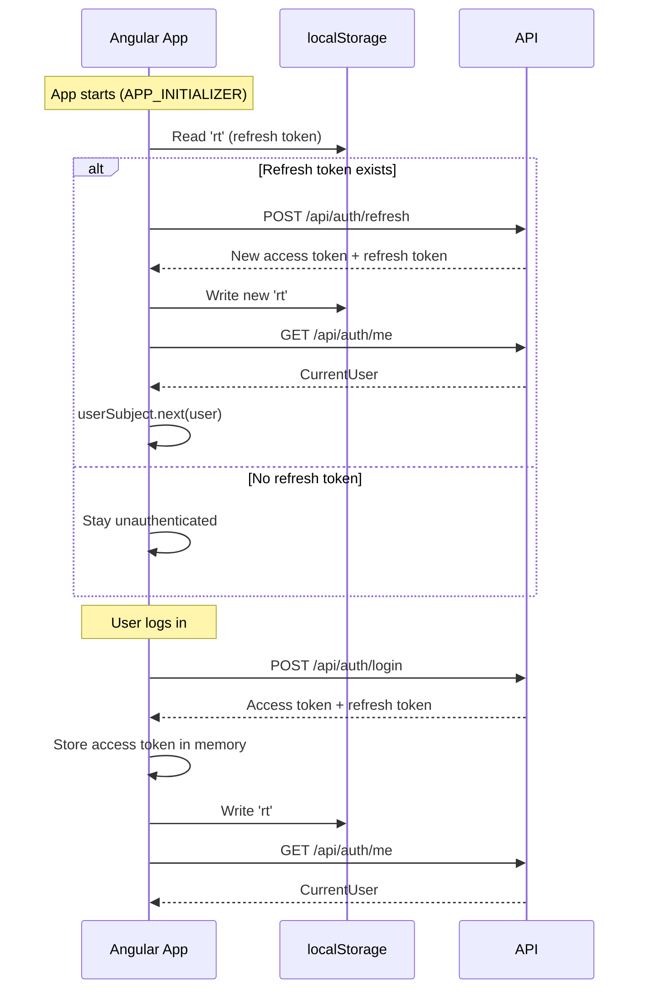

**Key:** The access token is never persisted to disk. If the browser closes, it is lost. `APP_INITIALIZER` restores the session silently on every page load using the refresh token stored in `localStorage`.

## 7.5 HTTP Interceptor

`auth.interceptor.ts` does:
1. Reads `AuthService.getAccessToken()`
2. Attaches `Authorization: Bearer {token}` to every request (unless it's a refresh request)
3. If a 401 response is received: calls `AuthService.refreshAccessToken()`, then retries the original request with the new token
4. If the refresh fails: calls `AuthService.clearSession()` and redirects to login

## 7.6 State Management

There is **no NgRx or third-party state library**. State is managed with Angular `BehaviorSubject` in services:
- `AuthService.currentUser$` — BehaviorSubject of current user (null when unauthenticated)
- Components use `Observable` subscriptions or `async` pipe directly

This is appropriate for the current scale. If the admin panel grows to many sub-views with shared state, introducing a state library should be considered.

## 7.7 Admin Panel

`admin.component.ts` is a single large component containing the full admin experience. It uses internal tab navigation (not Angular routing for sub-views). Tabs include:
- Children management
- Sponsors / Sponsorships
- Early Support (ledger entries)
- Fund Accounts
- Payment Reconciliation
- Donations & Donors
- Recurring Donations
- Campaigns
- Alerts
- Users
- Reports
- Audit Log
- Organisation Config

This is intentional — the admin panel was built for a small internal team. If the codebase grows, splitting into lazy-loaded child routes is recommended.

## 7.8 Design System

The frontend uses a custom light-cream design system with inline styles and CSS custom properties. **No Tailwind. No external CSS framework.** Key design tokens:
- Background: `#f3eeE4` (cream)
- Dark green: `#1c352c`
- Medium green: `#2f5d4f`
- Border: `#e3dccd`
- Text: `#546259`

This applies consistently to the admin panel, public website, and sponsor portal.

## 7.9 Environment Configuration

```typescript
// environment.ts (development)
export const environment = { apiBaseUrl: 'http://localhost:8080' };

// environment.prod.ts (production)
export const environment = { apiBaseUrl: 'https://your-api.herokuapp.com' };
```

Angular's build system substitutes the production environment file at build time with `--configuration production`.

## 7.10 Firebase Hosting

`firebase.json` rewrites all routes to `index.html` — this is required for Angular client-side routing. Without this rewrite, a direct browser load of `/admin` would return a 404 from Firebase.

Build output directory: `dist/jjt-angular/browser/`

---

# Part 8 — User Manual

## 8.1 First Login

1. Navigate to `https://sponsorone.app/login`
2. Enter admin credentials (default: `admin@jjt.org` / `Admin@JJT2024!`)
3. **Change the password immediately** via the admin panel → Settings → Change Password

## 8.2 Enrolling a Child

**Navigate to:** Admin Panel → Children → Add Child

Fields required:
- Roll Number (must be unique — e.g. `JJT-2026-001`)
- Full Name
- City (e.g. Karachi)
- Campus Name (e.g. Gulshan Campus)
- Monthly Education Amount (e.g. `2000` PKR)

Optional: School Name

A ledger is created automatically. The child will appear in the system with status **AVAILABLE**.

**Bulk import:** Admin Panel → Children → Import → Upload `.xlsx`. Download the template first to see the column format.

## 8.3 Recording Early Support (Org Funding)

When JJT funds a child before a sponsor is found:

1. Admin Panel → Children → select child → Ledger → Add Entry
2. Select month (e.g. `2026-07`)
3. Enter amount (defaults to child's education cost)
4. Click Save

The system will:
- Check the General Fund balance
- Warn if the debit would drop below the minimum reserve
- Create an immutable ledger entry
- Debit the General Fund

## 8.4 Creating a Sponsor

Admin Panel → Sponsors → Add Sponsor

Fields:
- Display Name (e.g. "Ali Khan" or "ABC Corporation")
- Contact Email (must be unique)
- Phone (optional)

If an email is already registered, the system shows a warning.

## 8.5 Committing a Sponsorship

Admin Panel → Sponsorships → New Commitment

1. Select sponsor
2. Select child (only AVAILABLE children are shown)
3. Select start month (must be next month or later)
4. Select commitment type: MONTHLY or YEARLY

The sponsorship is created as **PENDING**. The child's status becomes **RESERVED**.

## 8.6 Activating a Sponsorship

When the sponsor confirms their first payment:

Admin Panel → Sponsorships → PENDING tab → Activate

The child's status becomes **ALLOCATED**. The system sends a sponsorship activation email to the sponsor.

## 8.7 Monthly Payment Workflow

On the 1st of each month:
- The scheduler automatically creates EXPECTED payment records for all ACTIVE sponsorships
- No admin action required

On the 15th (due date — configurable):
- Unpaid records automatically become OVERDUE
- Admin alert is raised

When a payment arrives:

Admin Panel → Reconciliation → select month → find sponsor → Record Payment

Enter:
- Amount received
- Bank reference
- Date received

The system atomically creates a ledger entry (SPONSOR coverage) and credits the fund.

## 8.8 Adding Progress Updates

Admin Panel → Children → select child → Progress → Add Update

Enter the month and a narrative summary. One update per child per month maximum.

Sponsors can see progress updates in their portal under "My Children".

## 8.9 Recording a Donation

Admin Panel → Donations → Record Donation

1. Select or create a donor
2. Select donation type (GENERAL, ZAKAT, SADAQAH, etc.)
3. Enter amount, date, and optionally a fund account
4. Save

A receipt number is automatically generated (e.g. `JJT-2026-0001`). If the donor has an email, a receipt email is sent.

## 8.10 Viewing the Fund Balance

Admin Panel → Dashboard → Fund Accounts section shows:
- Current balance of all funds
- Whether any fund is below the minimum reserve

For full history: Admin Panel → Funds → select fund → Transactions.

## 8.11 Viewing Alerts

Alert badge is shown in the dashboard header. Admin Panel → Alerts shows all active alerts. Click Dismiss to clear an alert after addressing it.

## 8.12 Generating Reports

Admin Panel → Reports:
- **Cash Flow**: Shows monthly credits, debits, and running balance (6 or 12 months)
- **Portfolio**: Active/pending/expired sponsorship count and total monthly value
- **Reconciliation**: Specific month's payment status for all active sponsorships

**Exports:**
- Children list: Downloads Excel with all child details
- Donations list: Downloads Excel with all donations
- Reconciliation: Downloads Excel for a specific month
- Child Report: Downloads PDF with full child history

## 8.13 Managing Users

Admin Panel → Users (JJT_ADMIN only):
- Create SPONSOR user: links a login account to an existing sponsor record
- Create ORG_ADMIN user: creates an admin account with organisation scope
- Activate / Deactivate: deactivated users cannot log in

---

# Part 9 — DevOps Handbook

## 9.1 Prerequisites

| Tool | Required Version |
|---|---|
| Java | 17 (not 21, not 11) |
| Maven Wrapper | Included (`./mvnw`) |
| Docker | Any recent version |
| Node.js | 18+ |
| Angular CLI | 18 |
| Firebase CLI | Latest |
| Heroku CLI | Latest (for deployment) |

## 9.2 Local Development Setup

### Backend

```bash
# 1. Start PostgreSQL via Docker Compose
docker compose -f docker-compose.postgres.yml up -d

# 2. Verify database is up
docker ps  # should see jjt-postgres running

# 3. Start the Spring Boot application
./mvnw spring-boot:run
# Application starts on http://localhost:8080

# If using a newer JVM than 17:
JAVA_HOME=/path/to/jdk17 ./mvnw spring-boot:run
```

On first boot, the application will:
1. Run all Flyway migrations (V1–V23)
2. Seed the JJT organisation (via `OrganisationInitializer`)
3. Create the default admin user at `admin@jjt.org`
4. Seed the JJT General Education Fund

### Frontend

```bash
cd jjt-angular
npm install
npm start     # Angular dev server at http://localhost:4200
```

The Angular app proxies API calls to `http://localhost:8080` in development (configured in `environment.ts`).

## 9.3 Running Tests

```bash
# All tests — requires Docker for Testcontainers
./mvnw test

# Single test class
./mvnw test -Dtest=AuthIntegrationTest

# Build without tests
./mvnw clean package -DskipTests
```

**Important:** Tests use Testcontainers which spins up a real `postgres:16-alpine` container. Docker must be running before running tests. Tests share one Spring context and one PostgreSQL container via `@ServiceConnection` to keep the suite fast.

## 9.4 Environment Variables

| Variable | Default (local) | Required in Production |
|---|---|---|
| `SPRING_DATASOURCE_URL` | `jdbc:postgresql://localhost:5432/jjt` | Yes |
| `SPRING_DATASOURCE_USERNAME` | `jjt` | Yes |
| `SPRING_DATASOURCE_PASSWORD` | `jjt` | Yes |
| `JWT_SECRET` | `dev-only-secret-key-...` | **Yes — must be 64+ chars** |
| `JWT_ACCESS_EXPIRY_MS` | `900000` (15 min) | Optional |
| `JWT_REFRESH_EXPIRY_MS` | `604800000` (7 days) | Optional |
| `ADMIN_EMAIL` | `admin@jjt.org` | Yes |
| `ADMIN_PASSWORD` | `Admin@JJT2024!` | **Yes — must be changed** |
| `NOTIFICATIONS_ENABLED` | `false` | Set `true` in production |
| `MAIL_HOST` | (empty) | Required if notifications enabled |
| `MAIL_PORT` | `587` | Optional |
| `MAIL_USERNAME` | (empty) | Required if notifications enabled |
| `MAIL_PASSWORD` | (empty) | Required if notifications enabled |
| `NOTIFICATION_FROM_EMAIL` | `noreply@sponsorone.app` | Optional |
| `JJT_FUND_INITIAL_BALANCE` | `0.00` | Set on first deploy |
| `JJT_FUND_MIN_RESERVE` | `20000.00` | Optional |
| `JJT_PAYMENT_DUE_DAY` | `15` | Optional |

## 9.5 Building for Production

```bash
# Backend JAR
./mvnw clean package -DskipTests
# Output: target/jjt-platform-0.0.1-SNAPSHOT.jar

# Frontend production build
cd jjt-angular
npm run build
# Output: dist/jjt-angular/browser/
```

## 9.6 Heroku Deployment

```bash
# Add Heroku remote (first time)
heroku git:remote -a your-heroku-app-name

# Deploy from feature branch
git push heroku feature/phase-2:main

# Deploy from main
git push heroku main

# View logs
heroku logs --tail -a your-heroku-app-name

# Run a one-off command (e.g. check Flyway status)
heroku run ./mvnw flyway:info -a your-heroku-app-name
```

**`system.properties`** pins the Java runtime:
```
java.runtime.version=17
```

**`Procfile`** defines the web process:
```
web: java -Dserver.port=$PORT -jar target/jjt-platform-0.0.1-SNAPSHOT.jar
```

## 9.7 Firebase Hosting Deployment

```bash
cd jjt-angular
npm run build
firebase deploy --only hosting
```

Firebase automatically serves `index.html` for all routes (SPA mode configured in `firebase.json`).

## 9.8 Database Backup (Heroku PostgreSQL)

```bash
# Capture a backup
heroku pg:backups:capture -a your-heroku-app-name

# Download the latest backup
heroku pg:backups:download -a your-heroku-app-name

# List all backups
heroku pg:backups -a your-heroku-app-name

# Restore from backup
heroku pg:backups:restore <backup-id> DATABASE_URL -a your-heroku-app-name
```

**Critical:** The Essential-0 Heroku PostgreSQL plan does not include automated backups. Manual capture should be run before every significant migration or deployment. Consider upgrading to a plan with scheduled backups.

## 9.9 Rollback Strategy

**Application rollback:**
```bash
# Get commit hash of last good deploy
git log --oneline -5

# Push an older commit to Heroku
git push heroku <commit-hash>:main
```

**Database rollback:**
Flyway does not support automatic rollback. The strategy is:
1. Restore a database backup taken before the migration
2. All migrations in V1–V23 were written to be backward-compatible (additive, nullable columns first, backfills before constraints)
3. Never drop or rename a column in a live migration without a maintenance window

## 9.10 Scheduled Jobs

The `PaymentScheduler` runs inside the Heroku web dyno. When the dyno sleeps (free tier), scheduled jobs will not run on time. The jobs are idempotent — if they miss a scheduled execution, they can be triggered manually:

| Job | Schedule | Manual trigger |
|---|---|---|
| Generate EXPECTED payments | 1st of month, 00:05 | `POST /api/admin/payments/generate?month=YYYY-MM` |
| Mark OVERDUE payments | Daily, 02:00 | No manual endpoint; runs automatically next day |
| Generate recurring donations | Daily, 02:10 | `POST /api/admin/donations/recurring/generate` |

**Important:** Upgrade to a paid Heroku dyno to ensure scheduled jobs run reliably.

## 9.11 Production Checklist

Before going live:
- [ ] Change `JWT_SECRET` to a 64+ character random string
- [ ] Change `ADMIN_PASSWORD` from the default
- [ ] Set `NOTIFICATIONS_ENABLED=true` and configure SMTP credentials
- [ ] Set `JJT_FUND_INITIAL_BALANCE` to the fund's opening balance
- [ ] Set `JJT_FUND_MIN_RESERVE` to an appropriate reserve threshold
- [ ] Capture a database backup before first deploy
- [ ] Verify Flyway migrations applied cleanly in logs
- [ ] Verify the default admin user was created
- [ ] Verify the fund account was seeded
- [ ] Test login via the admin panel
- [ ] Upgrade Heroku PostgreSQL to a plan with scheduled backups
- [ ] Upgrade Heroku dyno from free to hobby to ensure scheduled jobs run

---

# Part 10 — Security Handbook

## 10.1 Authentication

JWT HS512 signed with a secret key. The secret must be at least 512 bits (64 bytes) in production. The development default key is intentionally short and must never be used in production.

Access tokens expire after 15 minutes. Refresh tokens expire after 7 days. Refresh tokens are:
- Stored client-side in `localStorage`
- Stored server-side as a SHA-256 hash in the `refresh_tokens` table
- Revoked on logout by setting `revoked_at`
- Rotated on every refresh (old token revoked, new token issued)

## 10.2 Authorization

Three roles:

| Role | Can do |
|---|---|
| `JJT_ADMIN` | Everything — creates other admins, manages all data |
| `ORG_ADMIN` | Admin operations within their organisation; cannot create JJT_ADMIN accounts |
| `SPONSOR` | Read-only access to their own children's ledger and progress |

Method-level security uses `@PreAuthorize("hasAnyRole('JJT_ADMIN', 'ORG_ADMIN')")` on controller classes. Fine-grained checks (e.g. sponsor can only see their own children) are enforced in the controller by comparing `principal.getSponsorId()` against the data.

## 10.3 Data Isolation

All business data carries `organisation_id`. Queries filter by the authenticated user's `orgId` from their JWT claims. A user from one organisation cannot access another organisation's data — this is enforced at the service layer, not the database layer (no Row Level Security yet).

## 10.4 Password Security

BCrypt with cost factor 12. Password changes require the current password to be provided.

## 10.5 OWASP Considerations

| Risk | Mitigation |
|---|---|
| SQL Injection | Spring Data JPA with parameterized queries throughout. No native SQL string concatenation. |
| XSS | Angular escapes template expressions by default. No `innerHTML` binding without sanitization. |
| CSRF | CSRF disabled (stateless JWT — no session cookies). Acceptable for a pure API/SPA architecture. |
| Broken Authentication | JWT with short expiry; server-side refresh token revocation; bcrypt passwords. |
| Broken Access Control | Method-level `@PreAuthorize`; sponsor-scoped endpoints check JWT claims against data. |
| Security Misconfiguration | `ddl-auto=none`; sensitive defaults documented; no debug endpoints in prod. |
| Sensitive Data Exposure | Access tokens never written to disk; passwords stored as hashes only. |

## 10.6 Missing Hardening (Future Work)

| Item | Priority | Notes |
|---|---|---|
| Rate limiting on `/api/auth/login` | High | Prevent brute-force attacks |
| WAF in front of the API | High | Cloud Armor (GCP) or Heroku Shield |
| HTTPS enforcement | High | Heroku provides this; ensure `server.forward-headers-strategy=native` |
| Refresh token family tracking | Medium | Detect token theft via reuse detection |
| Audit log integrity check | Medium | Hash chaining or external WORM storage |
| Two-factor authentication | Low | For JJT_ADMIN accounts |
| Content Security Policy headers | Low | Add via Spring Security headers |

## 10.7 Secrets Management

Currently managed via Heroku config vars. For production hardening, migrate to:
- Google Secret Manager (if migrating to GCP)
- HashiCorp Vault (cloud-agnostic)
- AWS Secrets Manager

Never commit secrets to git. The `.gitignore` excludes `.env` files. The `application.yml` uses `${ENV_VAR:default}` syntax — defaults are safe for local development only.

---

# Part 11 — Testing Strategy

## 11.1 Current Test Coverage

The project uses **integration tests** as the primary testing method. There are no unit tests for the domain layer despite the architecture supporting it.

Test location: `src/test/java/`

Test infrastructure:
- `TestcontainersConfiguration.java` — Shared Spring context + PostgreSQL container for all test classes
- `@ServiceConnection` — Testcontainers auto-wires the database URL into Spring
- `application-test.yml` — Test profile overrides (uses Testcontainers PostgreSQL)

## 11.2 Integration Testing

Each integration test class tests one API module through the full stack: HTTP → Controller → Service → JPA → Real PostgreSQL. This catches migration errors, constraint violations, and serialization issues that unit tests miss.

```bash
./mvnw test
# Docker must be running — Testcontainers starts postgres:16-alpine
```

## 11.3 Manual API Testing

Postman collections are in the `postman/` directory:
- `JJT-Phase1.postman_collection.json` — Phase 1 API flows
- `JJT-Platform-API.postman_collection.json` — Full platform APIs
- `JJT-dev.postman_environment.json` — Local environment (`http://localhost:8080`)

Import both files into Postman. Use the `JJT-dev` environment for local testing.

## 11.4 Recommended Testing Additions

### Domain Unit Tests (high value, easy to add)
```java
// Example: test the ledger invariant
@Test
void appendEntry_duplicateMonth_throwsLedgerInvariantViolation() {
    EducationSupportLedger ledger = EducationSupportLedger.create(UUID.randomUUID(), UUID.randomUUID());
    LedgerEntry entry = new LedgerEntry(..., YearMonthValue.of(YearMonth.of(2026, 7)), ...);
    ledger = ledger.appendEntry(entry);
    assertThrows(LedgerInvariantViolationException.class, () -> ledger.appendEntry(entry));
}
```
These tests are pure Java — no Spring, no database, no Testcontainers. Run in milliseconds.

### Testing Checklist for Each Feature

**API-level checks:**
- [ ] Happy path returns expected HTTP status and body shape
- [ ] Missing required fields return 400 with VALIDATION_ERROR
- [ ] Wrong role returns 403
- [ ] Duplicate records return 409
- [ ] Invalid state transitions return 409 or 400

**Business rule checks:**
- [ ] Ledger entry cannot be created twice for same month
- [ ] Two active sponsorships for same child are rejected
- [ ] Fund below reserve triggers alert
- [ ] Insufficient funds returns 422 with balance details

## 11.5 Frontend Testing

No automated frontend tests currently exist. Manual testing is done against the local development server.

For future test addition, the recommended approach:
- Unit tests: Angular `TestBed` for services
- Component tests: Angular Testing Library
- E2E: Playwright against the local stack

---

# Part 12 — Product Roadmap

## 12.1 Completed Features

Everything in Phase 1 and Phase 2 as documented in Parts 3 and 8.

## 12.2 Phase 3 — Autonomous Agents (Planned)

Phase 3 introduces a fully autonomous operations layer. Each agent handles one responsibility area. Full specification is in `docs/phase3/PHASE3_ROADMAP.md`.

| Agent | Milestone | Status |
|---|---|---|
| Agent Infrastructure (event bus, approval queue, run log) | M3.1 | Not started |
| Monthly Cycle Agent (payment generation, overdue, at-risk) | M3.2 | Not started |
| Reconciliation Agent (bank statement upload + auto-match) | M3.3 | Not started |
| Communication Agent (all sponsor/donor emails) | M3.4 | Not started |
| Progress Collection Agent (field data collection links) | M3.5 | Not started |
| Risk Detection Agent (LLM-powered portfolio health brief) | M3.6 | Not started |
| Board Report Agent (auto-generated monthly narrative) | M3.7 | Not started |
| Sponsor Matching Agent (AI-ranked candidate suggestions) | M3.8 | Not started |
| Data Quality Agent (integrity sweeps + annual export) | M3.9 | Not started |
| Campaign Automation Agent (milestone detection + close) | M3.10 | Not started |

The first deliverable (M3.1) creates the database tables (`agent_runs`, `human_approval_queue`), event bus infrastructure, approval queue UI, and agent registry — all without changing any existing functionality.

## 12.3 Phase 4 — Infrastructure & Scale (Future)

Based on `INFRA_ROADMAP.md`:

| Milestone | Description |
|---|---|
| Phase 0 | Immediate hardening: backup automation, HTTPS, monitoring |
| Phase 1 | CI/CD pipeline (GitHub Actions → Heroku) |
| Phase 2 | GCP migration: Cloud Run, Cloud SQL, Cloud Storage, Secret Manager |
| Phase 3 | Production hardening: WAF, staging environment, observability |

Target: $0 monthly infrastructure cost using Google for Nonprofits credits ($20,000/year).

## 12.4 Technical Debt

| Item | Priority | Notes |
|---|---|---|
| No domain layer unit tests | High | Architecture supports it; tests just haven't been written |
| No frontend automated tests | High | All testing is manual |
| No CI/CD pipeline | High | All deploys are manual `git push heroku` |
| No staging environment | High | Untested changes go straight to production |
| No database backup automation | Critical | Manual backup only |
| `AdminCommandService` is too large | Medium | Should be split by domain module |
| `AdminComponent` (frontend) is one huge component | Medium | Should be split into lazy-loaded admin sub-routes |
| No pagination on most list endpoints | Medium | Will become a problem at 500+ children |
| No soft delete | Low | Items are never deleted; orphan check is manual |

## 12.5 Nice-to-Have Features

- Mobile app for field staff (progress update submission)
- WhatsApp integration for sponsor notifications
- Zakat fund with Sharia compliance tracking (schema is ready; UI deferred)
- Donor-facing portal (self-service receipt download)
- Public campaign donation page with payment gateway
- IBAN validation for bank references
- Multi-currency support

---

# Part 13 — AI Integration

## 13.1 Current AI Usage

None. Phase 2 is fully deterministic.

## 13.2 Phase 3 AI Usage (Planned)

The Phase 3 design uses **Claude API via Spring AI** (`spring-ai-anthropic-spring-boot-starter`) for:

| Agent | AI Task |
|---|---|
| Risk Detection Agent | Translate rule-based findings into an executive narrative ("Weekly Intelligence Brief") |
| Board Report Agent | Generate monthly board report narrative in three sections |
| Board Report Agent | Natural language query → parameterized query template |
| Sponsor Matching Agent | Rank sponsor candidates for an available child with explanations |
| Sponsor Matching Agent | Generate personalised outreach email draft |
| Campaign Automation Agent | Generate impact narrative for campaign completion email |

**Model:** `claude-sonnet-4-6` (current production model)  
**Token limit per call:** 1024 tokens (enforced in config)  
**PII policy:** No personal names or email addresses are ever sent to the Claude API. Only aggregate statistics and anonymised identifiers.

## 13.3 AI Opportunities Beyond Phase 3

| Use Case | Value | Complexity |
|---|---|---|
| Donation amount forecasting | Predict next month's donations for fund planning | Medium |
| OCR of bank statements | Extract transactions from PDF bank statements automatically | High |
| Progress update quality scoring | Flag low-quality or templated progress updates for admin review | Low |
| Sponsor churn prediction | Identify sponsors likely to lapse before they do | Medium |
| Fraud detection on donations | Detect unusual donation patterns | High |
| Automatic duplicate detection | Detect near-duplicate children or sponsors before creation | Low |
| Chat interface for admin queries | "How many children in Karachi have no sponsor?" | Medium |

---

# Part 14 — Lessons Learned

## 14.1 Decisions That Worked Well

**Append-only ledger from Day 1:** Made financial audits trivial. There is no "who changed this entry" question because entries cannot be changed.

**Flyway from Day 1:** Every schema change is tracked, reviewable, and repeatable. No schema surprises between environments.

**PostgreSQL RULES for double enforcement:** Belt-and-suspenders. The application enforces append-only; the database enforces it independently. This was the right call for financial data.

**Separate transactions for audit and notifications:** Prevented a class of bugs where ancillary work (email) would roll back a business operation (payment recorded).

**Coverage type on ledger entries:** Distinguishing EARLY_SUPPORT from SPONSOR entries made reconciliation reports much simpler. Would have been painful to add later.

**Partial unique index for sponsorship constraint:** `WHERE status IN ('ACTIVE','PENDING')` allows EXPIRED rows without constraint. The V2 mistake (full unique index) and V4 correction taught this lesson early.

## 14.2 Decisions That Required Correction

**V2 → V4 (wrong unique index):** The initial unique index on `sponsorships(child_id)` was too broad. It prevented creating a new sponsorship for a child whose previous one had expired. Required a separate migration to drop it and a later migration (V15) to add the correct partial index.

**V5 → V8 (seed data in production migrations):** Test data was inserted in V5 and had to be removed in V8. Lesson: use test fixtures or TestDataInitializer (annotated with `@Profile("dev")`) instead of Flyway migrations for test data.

## 14.3 Intentional Postponements

| Feature | Reason for deferral |
|---|---|
| Multi-organisation support | Multi-org schema is built (V13, V19); code still has some `if orgId == null` paths. Full activation deferred to M2.4+ |
| Zakat fund UI | Requires Sharia compliance review; schema is ready |
| Payment gateway integration | Adds significant complexity; manual recording is sufficient for current scale |
| File storage (S3/GCS) | Generated files are served directly from memory; acceptable until scale demands persistence |
| Row Level Security | Organisation data isolation is application-enforced; RLS would be a defence-in-depth layer |

## 14.4 Critical Assumptions

1. **Organisation_id backfill is complete.** V13 and V16 performed bulk UPDATEs. If any historical row was created outside the Flyway path, it may have `organisation_id = NULL`. Check with: `SELECT COUNT(*) FROM children WHERE organisation_id IS NULL`.

2. **Fund balance is always computed from transactions.** Any direct database UPDATE to a `fund_transactions` row would be silently ignored by the PostgreSQL RULE, but could corrupt the balance if someone bypasses the rules (e.g. `ALTER TABLE` to drop the rule). The rules should be audited periodically.

3. **Scheduled jobs run.** The payment lifecycle depends on the scheduler running on the 1st and daily. If the Heroku dyno sleeps, jobs are skipped. Missed jobs are idempotent and will run the next day, but OVERDUE transitions may be late.

## 14.5 Scaling Considerations

| Bottleneck | Threshold | Solution |
|---|---|---|
| Fund balance computation (full table scan) | ~100K transactions | Add a daily snapshot of running balance |
| Child list (load all, derive status) | ~1000 children | Add sponsorship status to children table or paginate with server-side filtering |
| Admin component size | Current scale is fine | Split into lazy-loaded sub-routes when adding Phase 3 agents UI |
| Single Heroku dyno | ~100 concurrent users | Cloud Run with autoscaling (Phase 4) |
| Email delivery | ~1000 sponsors | Dedicated ESP (SendGrid/Mailgun) instead of SMTP relay |

---

# Part 15 — New Developer Onboarding

## 15.1 Recommended Reading Order

1. This document (you are here) — 2–3 hours
2. `CLAUDE.md` — project commands, architecture, configuration — 15 minutes
3. `docs/phase2/PHASE2_ROADMAP.md` — what was built and why — 30 minutes
4. `docs/phase3/PHASE3_ROADMAP.md` — future direction — 30 minutes
5. Walk through the migrations V1→V23 in order — 45 minutes
6. Read `core/domain/entity/` — understand the pure domain model — 30 minutes
7. Read `AdminCommandService` — understand how use cases connect to infrastructure — 30 minutes
8. Set up the local environment and get the app running — 1 hour

Total: ~6 hours to productive understanding.

## 15.2 Common Mistakes to Avoid

**1. Creating a new column without a Flyway migration**  
`hibernate.ddl-auto=none` — Hibernate will not create the column. You must write a `V{n}__description.sql` migration file.

**2. Adding business logic to a controller**  
Controllers must stay thin — validation, parameter extraction, response mapping only. Business logic belongs in the application/use case layer or the service layer.

**3. Returning a JPA entity from a service to a controller**  
Map to a domain object first, or map directly to a DTO. Never expose JPA entities outside the infrastructure layer.

**4. Adding a new `@ExceptionHandler` to a controller**  
All exception handling is in `GlobalExceptionHandler`. Add new exception types there.

**5. Trying to UPDATE or DELETE a ledger entry**  
The PostgreSQL RULE will silently discard it. If you need to correct a ledger entry, the correct approach is to add a `CORRECTION` type entry (planned in the Phase 2 roadmap as a future enhancement).

**6. Hardcoding organisation_id**  
Every query that filters by organisation must use the `orgId` from the JWT principal, not a hardcoded value.

## 15.3 Development Conventions

**Naming:**
- Controllers: `{Domain}Controller.java`
- Services: `Admin{Domain}Service.java`
- JPA entities: `{Domain}Entity.java`
- Mappers: `{Domain}Mapper.java`
- DTOs: descriptive names matching the operation (`RecordPaymentRequest`, `SponsorPaymentResponse`)

**Transactions:**
- Read-only operations: `@Transactional(readOnly = true)`
- Write operations: `@Transactional`
- Audit and notification: `@Transactional(propagation = Propagation.REQUIRES_NEW)`

**UUID generation:**
- For entities where the client supplies the ID (children, sponsors, sponsorships, ledger entries): the client generates the UUID before submitting. This allows the frontend to create stable IDs without a round-trip.
- For entities managed purely by the server (payments, transactions, notifications, alerts): `DEFAULT gen_random_uuid()` in the database.

**Validation:**
- Use `@Valid` + Jakarta Bean Validation annotations on DTOs for input validation
- Domain validation (business rules) goes in domain constructors or factory methods
- Do not duplicate validation between layers

## 15.4 Branching Strategy

| Branch | Purpose |
|---|---|
| `main` | Production-ready code |
| `feature/phase-N` | Current phase development branch |
| `feature/M{milestone}-{description}` | Individual feature branches |

PRs merge from feature branches into the phase branch, then the phase branch merges to main when ready to deploy.

## 15.5 Definition of Done

A feature is done when:
- [ ] Backend endpoint works correctly
- [ ] Frontend integration is complete
- [ ] Integration test covers the happy path
- [ ] Flyway migration applied cleanly on a fresh database
- [ ] No existing tests broken
- [ ] API is accessible from Postman with the correct collection entry

---

# Part 16 — Glossary

| Term | Definition |
|---|---|
| **Allocated** | A child's derived status when they have an ACTIVE sponsorship. The child is fully funded for the current month. |
| **At-Risk Sponsorship** | A sponsorship with 2 or more consecutive OVERDUE payment months. Appears as a warning in the monthly reconciliation view. |
| **Available** | A child's derived status when they have no ACTIVE or PENDING sponsorship. They are eligible for new sponsorship. |
| **Campus Name** | The local school campus or branch where the child studies. One school may have multiple campuses. |
| **Commitment Type** | How a sponsor pays: MONTHLY (once per month) or YEARLY (once per year, covering 12 months). |
| **Coverage Type** | The source of funding for a ledger entry: EARLY_SUPPORT (org general fund) or SPONSOR (direct sponsor payment). |
| **Donation** | A financial contribution from a donor to a fund account. Distinct from sponsor payments. |
| **Donor** | A person or organisation that makes a financial donation. May or may not be a Sponsor. |
| **Early Support** | An organisation-funded ledger entry recorded when JJT pays for a child's education before a sponsor is found. |
| **Education Support Ledger** | The append-only financial record of every month a specific child's education was funded. One ledger per child. |
| **Fund Account** | A named financial account. JJT has one: the General Education Fund. The balance is computed from transactions. |
| **Fund Transaction** | A single CREDIT or DEBIT against a fund account. Append-only — can never be modified. |
| **General Education Fund** | JJT's primary financial pool. Funded by donations; debited when EARLY_SUPPORT entries are created. |
| **JJT** | Junior Jinnah Trust — the charity organisation operating this platform. |
| **JJT_ADMIN** | The highest privilege role. Can create ORG_ADMIN users, access all data, and manage platform configuration. |
| **Ledger Entry** | One record in the Education Support Ledger. Represents one month of funding for one child. Immutable. |
| **Min Reserve** | The minimum fund balance below which an alert is raised. Default: PKR 20,000. |
| **ORG_ADMIN** | An admin scoped to one organisation. Can do everything except create JJT_ADMIN accounts. |
| **Organisation** | The multi-tenancy container. JJT operates as a single organisation (`slug=jjt`). |
| **OVERDUE** | A SponsorPayment status assigned when a payment was EXPECTED but not received by the due date. |
| **PKR** | Pakistani Rupee — the default currency for all financial records. |
| **Progress Update** | A narrative monthly report on a child's educational progress. One per child per month. |
| **Receipt Number** | A sequential identifier for a donation receipt. Format: `JJT-{YEAR}-{NNNN}`. |
| **Reconciliation** | The monthly process of matching received bank payments to expected sponsor payment records. |
| **Reserved** | A child's derived status when they have a PENDING sponsorship (commitment made, payment not yet confirmed). |
| **Roll Number** | A unique identifier for a child within their campus. Examples: `JJT-2026-001`. Immutable once set. |
| **Sponsor** | An individual or organisation who commits to funding a specific child's monthly education cost. |
| **Sponsorship** | The formal relationship between a sponsor and a child. Lifecycle: PENDING → ACTIVE → EXPIRED. |
| **Sponsorship Activation** | The admin action of changing a PENDING sponsorship to ACTIVE, confirming the first payment has been received. |

---

# Part 17 — Appendices

## Appendix A — Architecture Diagrams

### A.1 System Layers

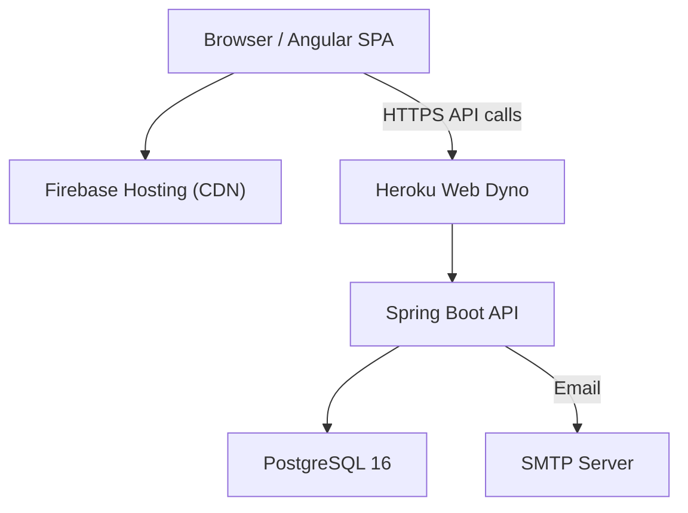

### A.2 Request Flow

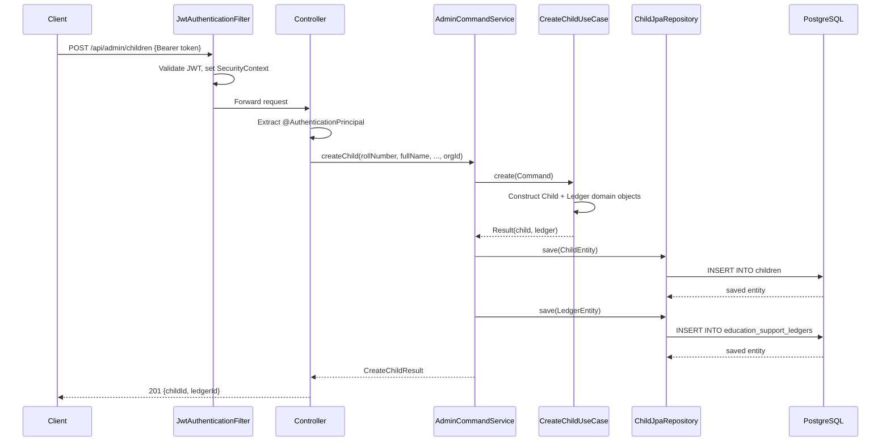

### A.3 Fund Debit Flow (Early Support)

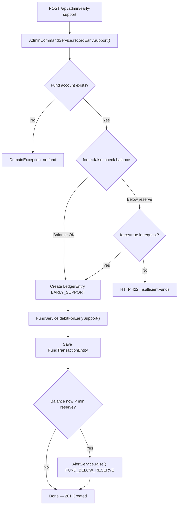

## Appendix B — State Diagrams

### B.1 Sponsorship Status

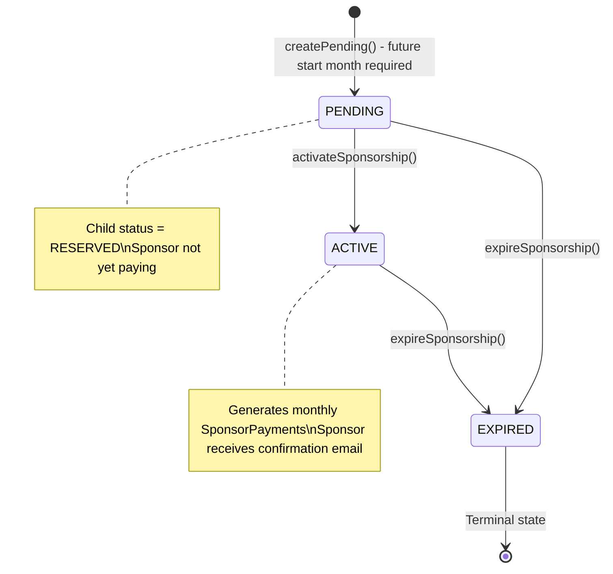

### B.2 SponsorPayment Status

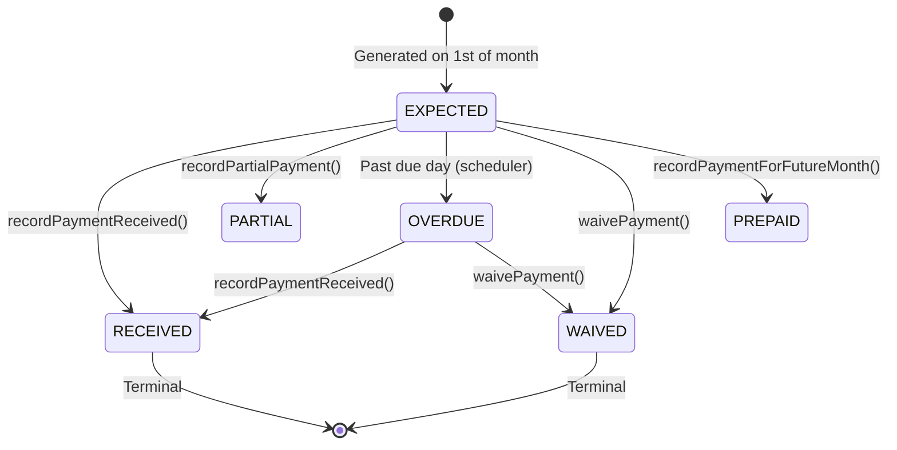

### B.3 Donation Status

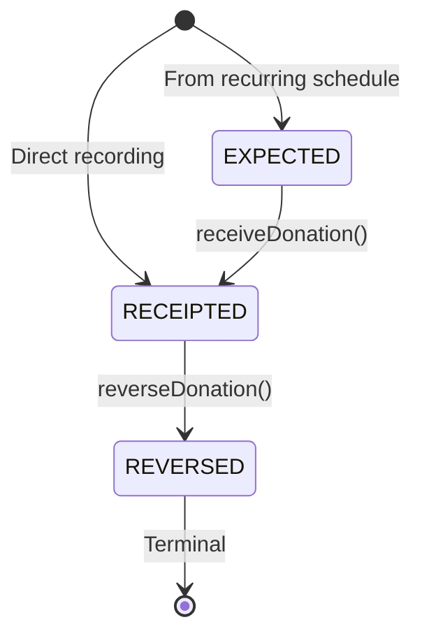

### B.4 Campaign Status

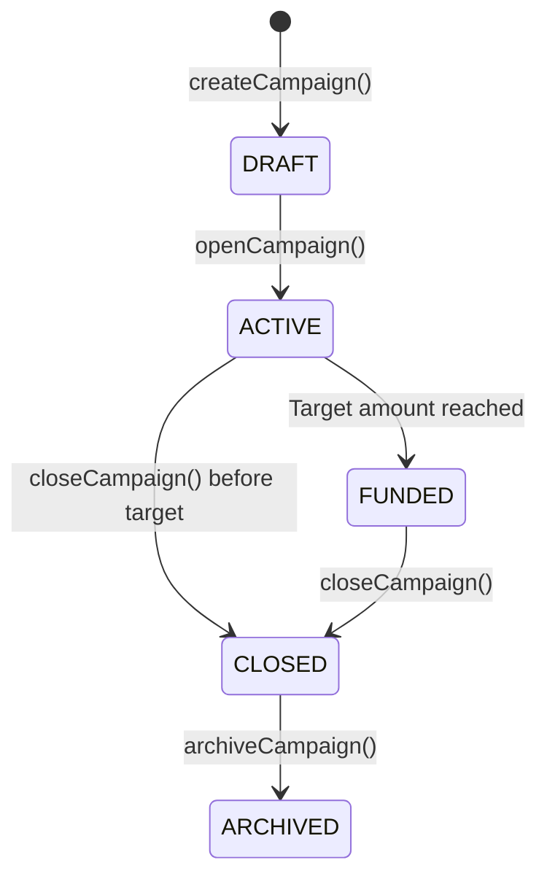

## Appendix C — Deployment Diagram

```
┌─────────────────────────────────────────────────────────┐
│                     Internet                             │
└──────────────────┬──────────────────────┬───────────────┘
                   │                      │
        ┌──────────▼──────┐    ┌──────────▼──────────┐
        │ Firebase CDN    │    │ Heroku Web Dyno     │
        │ sponsorone.app  │    │ port: $PORT         │
        │ Angular 18 SPA  │    │ Spring Boot JAR     │
        │ dist/browser/   │    │ Java 17             │
        └─────────────────┘    └──────────┬──────────┘
                                          │
                               ┌──────────▼──────────┐
                               │ Heroku PostgreSQL   │
                               │ Essential-0         │
                               │ PostgreSQL 16       │
                               └─────────────────────┘
```

## Appendix D — Configuration Reference

### Backend environment variables

See Part 9.4 for the complete table.

### Frontend environments

| File | Used when | API base URL |
|---|---|---|
| `environment.ts` | `npm start` (development) | `http://localhost:8080` |
| `environment.prod.ts` | `npm run build` | Heroku API URL |

### Cron schedule reference

| Job | Cron expression | Human description |
|---|---|---|
| Generate EXPECTED payments | `0 5 0 1 * *` | 1st of every month at 00:05 |
| Mark OVERDUE | `0 0 2 * * *` | Every day at 02:00 |
| Generate recurring donations | `0 10 2 * * *` | Every day at 02:10 |

## Appendix E — Troubleshooting Guide

### Application fails to start

**Symptom:** Spring Boot fails with Flyway error on startup.  
**Cause:** Database schema is at a different migration version than expected.  
**Fix:** Check `flyway_schema_history` table for failed migrations. Fix the migration issue and restart.

### Scheduled jobs not running

**Symptom:** No EXPECTED payment records generated on the 1st.  
**Cause:** Heroku free dyno was asleep at 00:05.  
**Fix:** Manually trigger via `POST /api/admin/payments/generate?month=YYYY-MM`. Upgrade to a paid dyno.

### Fund balance shows zero unexpectedly

**Symptom:** `GET /api/admin/funds/{id}/balance` returns 0 even though transactions exist.  
**Cause:** `fund_account_id` FK mismatch — transactions reference a different account ID.  
**Fix:** Query `SELECT * FROM fund_accounts` and `SELECT DISTINCT fund_account_id FROM fund_transactions` to compare IDs.

### Email not being sent

**Symptom:** Notifications enabled but no emails received.  
**Cause 1:** `NOTIFICATIONS_ENABLED=false` (default).  
**Cause 2:** SMTP credentials wrong.  
**Fix:** Check `email_notifications` table — rows with status=FAILED have an `error_message`. Check SMTP config in Heroku config vars.

### Login returns 401 with correct credentials

**Cause 1:** User account `active=false`.  
**Cause 2:** Password was bcrypt-encoded with a different salt (shouldn't happen with Spring Security's encoder).  
**Fix:** Check `SELECT active, email FROM users WHERE email = 'user@example.com'`. If inactive, activate via admin panel or `UPDATE users SET active=true WHERE email='...'`.

### Ledger entry not appearing after creation

**Cause:** The PostgreSQL RULE `no_update_ledger_entries` silently discards any update. If the code tried to UPDATE rather than INSERT, nothing was saved.  
**Fix:** Verify with `SELECT * FROM ledger_entries WHERE child_id = 'uuid' ORDER BY entry_month`.

## Appendix F — Known Limitations

1. **No pagination on sponsor list, child list, or alert list.** At 500+ records these endpoints will be slow. Add `Pageable` parameters.

2. **Fund balance is computed from full transaction scan.** At 100K+ transactions this will be slow. Add a daily cached snapshot.

3. **Admin panel is a single component.** All admin functionality is in one Angular component. This is maintainable at current scale but should be split into child routes when Phase 3 UI is added.

4. **No file storage.** PDF and Excel exports are generated in memory and served as the HTTP response body. They are not persisted anywhere. If the request fails mid-download, the user must re-request.

5. **OVERDUE alert fires for every overdue payment.** There is no deduplication — if a sponsor has 3 overdue months, 3 separate alerts are raised. Alert fatigue may become an issue.

6. **No soft delete.** Nothing is ever deleted. Orphaned records (e.g. a sponsor with no sponsorships) accumulate over time. Plan a data hygiene routine.

7. **Heroku Essential-0 PostgreSQL has no automated backups.** This is a critical risk. Manual backups must be taken before every significant deployment.

---

*End of JJT Platform Knowledge Base — Version 1.0*

*This document was generated on 2026-07-02 and reflects the state of the codebase as of that date. It should be updated whenever significant architectural changes are made.*
