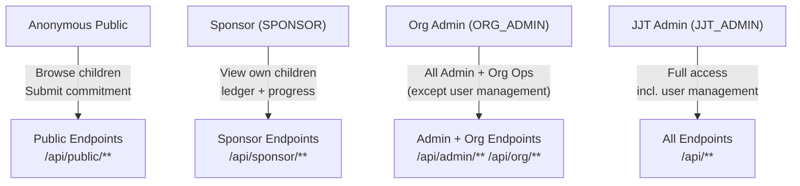
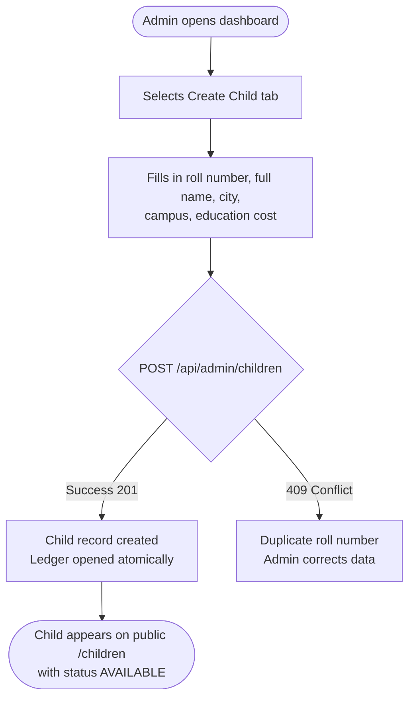
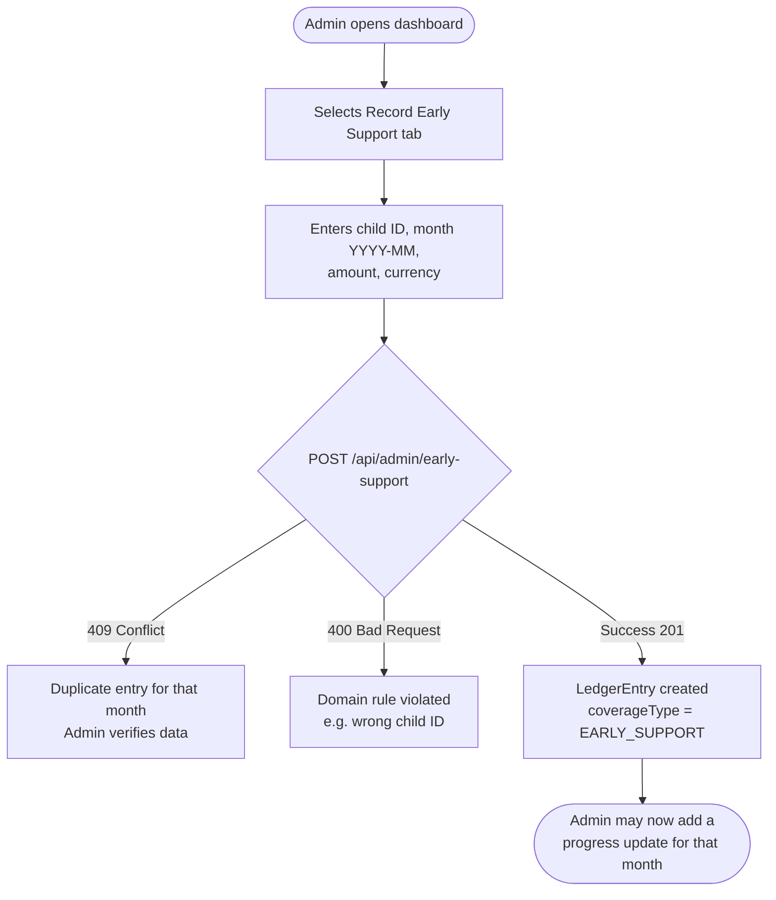
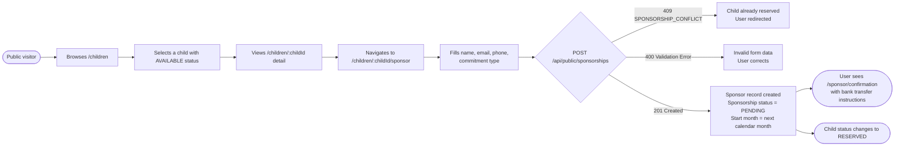
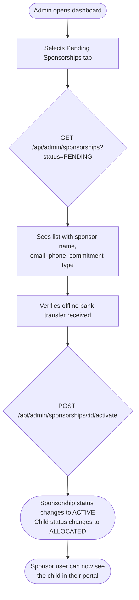
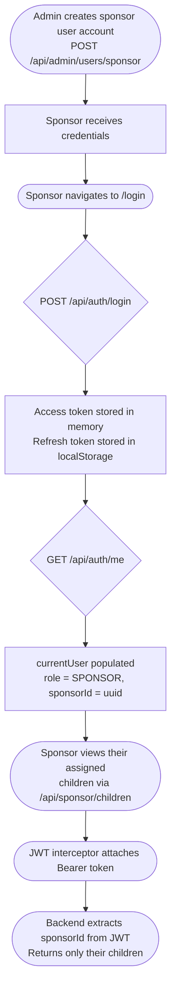
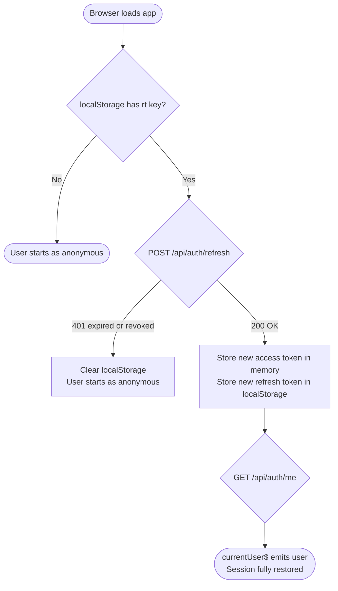
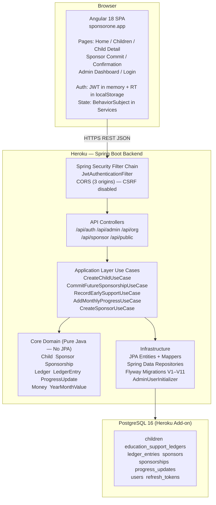
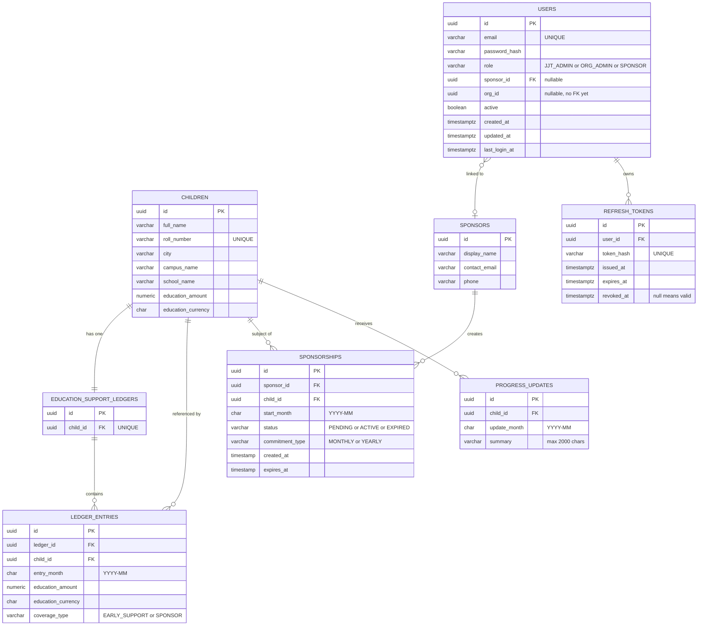

# Business Requirements Document (BRD)

## Junior Jinnah Trust (JJT) — Education Sponsorship Platform

| | |
|---|---|
| **Document Version** | 1.0 |
| **Prepared By** | Business Analysis — JJT Platform Team |
| **Prepared For** | Junior Jinnah Trust (JJT) |
| **Date** | 27 June 2026 |
| **Status** | Final Draft |
| **Classification** | Client Confidential |

---

## Table of Contents

1. [Executive Summary](#1-executive-summary)
2. [Project Overview](#2-project-overview)
3. [Business Objectives](#3-business-objectives)
4. [Problem Statement](#4-problem-statement)
5. [Scope](#5-scope)
   - 5.1 [In Scope](#51-in-scope)
   - 5.2 [Out of Scope](#52-out-of-scope)
6. [Stakeholders](#6-stakeholders)
7. [User Roles and Permissions](#7-user-roles-and-permissions)
8. [Functional Requirements](#8-functional-requirements)
   - 8.1 [Authentication Module](#81-authentication-module)
   - 8.2 [Child Management Module](#82-child-management-module)
   - 8.3 [Sponsorship Management Module](#83-sponsorship-management-module)
   - 8.4 [Ledger Module](#84-ledger-module)
   - 8.5 [Progress Tracking Module](#85-progress-tracking-module)
   - 8.6 [Public Commitment Module](#86-public-commitment-module)
   - 8.7 [Sponsor Portal Module](#87-sponsor-portal-module)
   - 8.8 [Admin Dashboard Module](#88-admin-dashboard-module)
   - 8.9 [User Management Module](#89-user-management-module)
9. [Business Workflows](#9-business-workflows)
10. [System Architecture Overview](#10-system-architecture-overview)
11. [Database Overview](#11-database-overview)
12. [API Overview](#12-api-overview)
13. [Non-Functional Requirements](#13-non-functional-requirements)
14. [Business Rules](#14-business-rules)
15. [Validation Rules](#15-validation-rules)
16. [Error Handling](#16-error-handling)
17. [Assumptions](#17-assumptions)
18. [Constraints](#18-constraints)
19. [Dependencies](#19-dependencies)
20. [Risks](#20-risks)
21. [Acceptance Criteria](#21-acceptance-criteria)
22. [Future Enhancements](#22-future-enhancements)
23. [Open Questions](#23-open-questions)
24. [Glossary](#24-glossary)
25. [Appendix](#25-appendix)

---

## 1. Executive Summary

The **Junior Jinnah Trust (JJT) Education Sponsorship Platform** is a purpose-built web application that digitises and centralises the educational sponsorship operations of Junior Jinnah Trust, a Pakistani charitable organisation that funds children's school education.

Prior to this platform, all operational tracking was performed in spreadsheets. This created an environment where missed or late sponsor payments could go unnoticed, leaving children at risk of educational disruption. The platform replaces manual, error-prone spreadsheet processes with a structured, auditable, and accessible digital system.

The platform serves three distinct user groups: **JJT administrators** who manage all data and operations; **org admin staff** who manage children and daily operations; and **sponsors** who gain read-only visibility into the children they support. Additionally, a **public-facing website** enables prospective sponsors to browse available children and submit sponsorship commitments without any prior registration.

The Phase-1 release (current state as of this document) delivers child registration, ledger management, sponsorship lifecycle management, progress updates, and a full authentication and authorisation system. Financial transactions remain offline — the platform records commitments and outcomes while money continues to move through the trust's existing banking arrangements.

---

## 2. Project Overview

| Attribute | Detail |
|-----------|--------|
| **Organisation** | Junior Jinnah Trust (JJT) |
| **Platform Name** | JJT Education Sponsorship Platform |
| **Phase** | Phase 1 |
| **Frontend** | Angular 18 SPA hosted at sponsorone.app |
| **Backend** | Spring Boot 3.2 REST API on Heroku |
| **Database** | PostgreSQL 16 (Heroku managed add-on) |
| **Primary Users** | JJT Admins, Org Admins, Sponsors, Anonymous Public |
| **Production API** | jjt-platform-23fdba49b06d.herokuapp.com |
| **Production Frontend** | sponsorone.app |

---

## 3. Business Objectives

| # | Objective | Measurable Outcome |
|---|-----------|-------------------|
| BO-01 | Eliminate spreadsheet-based tracking of child education expenses | Zero spreadsheet dependency for monthly expense recording |
| BO-02 | Provide complete visibility into sponsor payment status | Admins can see all pending, active, and expired sponsorships at a glance |
| BO-03 | Prevent a child's education from being interrupted due to administrative gaps | Every child has an associated ledger; gaps in coverage are immediately visible |
| BO-04 | Enable prospective sponsors to commit to a child online without admin involvement | Public sponsorship form is accessible 24/7 with no account required |
| BO-05 | Maintain an immutable audit trail of all financial support for each child | Append-only ledger ensures no record can be altered or deleted |
| BO-06 | Provide sponsors with transparency into the impact of their contributions | Sponsors can log in and view ledger entries and progress updates for their children |
| BO-07 | Scale the organisation's operational capacity without proportionally increasing admin overhead | Structured data enables bulk management; idempotent imports prevent duplicate data entry |

---

## 4. Problem Statement

Junior Jinnah Trust funds the monthly education expenses for children enrolled in its programme across multiple cities in Pakistan. Before the platform existed, the following problems were documented:

1. **No visibility into funding gaps.** When a sponsor was late or absent, there was no mechanism to determine which children were at risk of losing their educational support. The trust would pay from a central pool without knowing who owed what.

2. **Spreadsheet fragility.** Education records, sponsor details, and payment commitments were stored in spreadsheets that were difficult to share securely, lacked version control, and were prone to accidental modification or deletion.

3. **No self-service for sponsors.** Sponsors had no way to independently view updates on the children they supported without contacting an administrator.

4. **No structured public onboarding path.** A member of the public who wanted to sponsor a child had to engage with the organisation directly, creating a friction-heavy, manual process.

5. **No auditability.** There was no reliable way to reconstruct the history of support for any given child to answer questions from regulators, auditors, or donors.

The JJT Platform was built to address all five of these problems within a focused Phase-1 scope.

---

## 5. Scope

### 5.1 In Scope

| # | Feature Area | Description |
|---|-------------|-------------|
| IS-01 | Child Registration | Admin creation of child profiles with education cost and school details |
| IS-02 | Education Support Ledger | Append-only monthly ledger per child recording who covered the month's expenses |
| IS-03 | Early Support Recording | Admins record months where the organisation's central pool covered costs |
| IS-04 | Sponsorship Lifecycle | Full PENDING → ACTIVE → EXPIRED lifecycle management for each sponsorship |
| IS-05 | Public Sponsorship Commitment | Anonymous online form for members of the public to commit to sponsoring a child |
| IS-06 | Admin Sponsorship Management | Admin management of both public-submitted and directly-created sponsorships |
| IS-07 | Progress Updates | Admins record monthly written progress updates for each child |
| IS-08 | Sponsor Portal | Read-only portal for sponsors to view their assigned children and updates |
| IS-09 | Authentication | JWT-based authentication with access and refresh tokens |
| IS-10 | Role-Based Access Control | Three roles: JJT_ADMIN, ORG_ADMIN, SPONSOR with distinct permissions |
| IS-11 | User Account Management | Admin creation and deactivation of sponsor and org admin user accounts |
| IS-12 | Public Website | Publicly accessible pages: home, children listing, child detail, sponsor form |

### 5.2 Out of Scope

| # | Feature | Reason |
|---|---------|--------|
| OOS-01 | Payment processing (Stripe, bank integration) | All financial transactions occur offline via the trust's bank account |
| OOS-02 | Automated sponsor matching | Matching is performed manually by administrators |
| OOS-03 | Email or SMS notifications | No notification system in Phase-1 |
| OOS-04 | Attendance tracking | Not required in Phase-1 |
| OOS-05 | Academic grade tracking (detailed) | Progress is captured as free-text summaries only |
| OOS-06 | Sponsor self-registration | Sponsor accounts must be created by a JJT_ADMIN |
| OOS-07 | Multi-organisation support | Phase-1 serves a single charitable trust |
| OOS-08 | Mobile native applications | Web-only (responsive browser-based SPA) |
| OOS-09 | Document or image upload | No file attachment capability |
| OOS-10 | Reporting or analytics dashboards | Summary data accessible via API but no dedicated reporting interface |

---

## 6. Stakeholders

| Stakeholder | Role | Interest in Platform |
|------------|------|---------------------|
| **Junior Jinnah Trust — Executive** | Project Owner | Oversees programme delivery; needs visibility into coverage gaps and overall programme health |
| **JJT Administrators** | Primary System Operators | Create and manage all data; activate sponsorships; manage user accounts |
| **Org Admin Staff** | Day-to-day operators | Record monthly support and progress updates; view all children and ledger data |
| **Sponsors** | Beneficiaries of the Sponsor Portal | View the children they support, track their ledger, and read progress updates |
| **General Public (Prospective Sponsors)** | Consumers of the Public Website | Browse available children; submit sponsorship commitments online |
| **Enrolled Children (Indirect)** | Beneficiaries | Do not interact with the platform directly; their education continuity is the core outcome |
| **Development Team** | Delivery | Build, test, and maintain the platform |
| **Hosting Provider (Heroku)** | Infrastructure Operator | Platform availability and database management |

---

## 7. User Roles and Permissions

### Role Overview



### Permissions Matrix

| Capability | Anonymous | SPONSOR | ORG_ADMIN | JJT_ADMIN |
|-----------|:---------:|:-------:|:---------:|:---------:|
| Browse public children list | ✓ | ✓ | ✓ | ✓ |
| View child detail (public) | ✓ | ✓ | ✓ | ✓ |
| Submit public sponsorship commitment | ✓ | — | — | — |
| View own assigned children | — | ✓ | — | — |
| View own assigned child ledger | — | ✓ | — | — |
| View own assigned child progress | — | ✓ | — | — |
| Create a child | — | — | ✓ | ✓ |
| Create a sponsor record | — | — | ✓ | ✓ |
| Record early support ledger entry | — | — | ✓ | ✓ |
| Add progress update | — | — | ✓ | ✓ |
| Create/activate/expire sponsorship | — | — | ✓ | ✓ |
| View all children + ledger (org view) | — | — | ✓ | ✓ |
| Create sponsor user account | — | — | — | ✓ |
| Create org admin user account | — | — | — | ✓ |
| Activate/deactivate user accounts | — | — | — | ✓ |
| List all users | — | — | — | ✓ |

### Data Isolation Rules

- A **SPONSOR** user can only access data for children where a sponsorship record links their `sponsorId` (extracted from JWT claims) to the child. This is enforced server-side on every sponsor endpoint — possessing a valid JWT does not grant cross-sponsor data access.
- **ORG_ADMIN** and **JJT_ADMIN** can access all children and all ledger data across the entire programme.

---

## 8. Functional Requirements

### 8.1 Authentication Module

**Module Purpose:** Provide secure, stateless authentication for platform users. Manage login sessions using short-lived JWT access tokens with rotating refresh tokens.

| ID | Requirement | Priority |
|----|-------------|----------|
| AUTH-01 | The system shall authenticate users via email and password against BCrypt-hashed credentials stored in the database | Must Have |
| AUTH-02 | On successful login the system shall issue a JWT access token (15-minute expiry) and an opaque refresh token (7-day expiry) | Must Have |
| AUTH-03 | The access token shall be stored in application memory (not in persistent browser storage) to limit XSS exposure | Must Have |
| AUTH-04 | The refresh token shall be stored in `localStorage` under the key `rt` and as a SHA-256 hash in the database for server-side revocability | Must Have |
| AUTH-05 | The system shall support token refresh: a valid, non-revoked refresh token shall generate a new access token and a new refresh token (rotation); the old refresh token shall be revoked atomically | Must Have |
| AUTH-06 | The system shall support logout: the submitted refresh token shall be revoked (marked with `revoked_at`) and the client session shall be cleared | Must Have |
| AUTH-07 | On page load or hard browser refresh, the Angular application shall silently attempt to restore the user session using the stored refresh token before rendering any protected content | Must Have |
| AUTH-08 | The system shall provide a `/me` endpoint that returns the authenticated user's identity, role, sponsorId, and orgId | Must Have |
| AUTH-09 | Authenticated users of any role shall be able to change their own password via a dedicated endpoint requiring the current password | Must Have |
| AUTH-10 | Deactivated user accounts shall be rejected at login with a 401 response | Must Have |
| AUTH-11 | On any 401 response, the Angular HTTP interceptor shall silently attempt a token refresh and retry the original request once; if refresh fails, it shall clear the session and redirect to the login page | Must Have |

---

### 8.2 Child Management Module

**Module Purpose:** Manage the register of children enrolled in the JJT education support programme.

| ID | Requirement | Priority |
|----|-------------|----------|
| CHILD-01 | Administrators shall be able to create a new child record with the following attributes: roll number, full name, city, campus name, optional school name, and monthly education cost (amount + currency) | Must Have |
| CHILD-02 | An Education Support Ledger shall be created automatically and atomically when a child is registered; it is not possible to create a child without a ledger | Must Have |
| CHILD-03 | Each child shall have a unique roll number across the entire system | Must Have |
| CHILD-04 | Child IDs and Ledger IDs shall be provided by the administrator at creation time to support idempotent bulk imports | Must Have |
| CHILD-05 | The system shall derive and return each child's availability status at query time — it shall never be stored: `AVAILABLE` (no active or pending sponsorship), `RESERVED` (has a pending sponsorship), `ALLOCATED` (has an active sponsorship) | Must Have |
| CHILD-06 | The public-facing children listing shall return all registered children with their derived availability status | Must Have |
| CHILD-07 | Administrators and org admins shall be able to retrieve a single child's full profile, ledger, and progress updates | Must Have |

---

### 8.3 Sponsorship Management Module

**Module Purpose:** Manage the full lifecycle of sponsorship commitments between sponsors and children.

| ID | Requirement | Priority |
|----|-------------|----------|
| SPON-01 | An administrator shall be able to directly create a sponsorship linking an existing sponsor record to a child with a future start month | Must Have |
| SPON-02 | A newly created sponsorship shall have status `PENDING` | Must Have |
| SPON-03 | An administrator shall be able to transition a sponsorship from `PENDING` to `ACTIVE` | Must Have |
| SPON-04 | An administrator shall be able to transition a sponsorship from `ACTIVE` to `EXPIRED` | Must Have |
| SPON-05 | Only one `ACTIVE` or `PENDING` sponsorship shall exist per child at any given time | Must Have |
| SPON-06 | The start month of a new sponsorship must be strictly in the future (after the current calendar month) | Must Have |
| SPON-07 | A sponsorship shall record the commitment type: `MONTHLY` (indefinite monthly commitment) or `YEARLY` (annual commitment) | Must Have |
| SPON-08 | Administrators shall be able to list all sponsorships filtered by status (`PENDING`, `ACTIVE`, `EXPIRED`) | Must Have |
| SPON-09 | Administrators shall be able to view all sponsorships associated with a specific child | Must Have |
| SPON-10 | Administrators shall be able to query whether a specific child currently has an active sponsorship | Must Have |
| SPON-11 | Sponsorship records shall include the sponsor's display name, contact email, and phone number to support offline verification | Must Have |

---

### 8.4 Ledger Module

**Module Purpose:** Maintain an immutable, append-only monthly financial record for each child showing who covered their education expenses and when.

| ID | Requirement | Priority |
|----|-------------|----------|
| LED-01 | Each child shall have exactly one Education Support Ledger, created at the time the child is registered | Must Have |
| LED-02 | Administrators shall be able to append a ledger entry to a child's ledger for any given month | Must Have |
| LED-03 | Each ledger entry shall record: the month covered (YYYY-MM), the education amount and currency, and the coverage type | Must Have |
| LED-04 | Coverage type shall be one of: `EARLY_SUPPORT` (expenses covered by the organisation's central pool) or `SPONSOR` (expenses covered by a named sponsor) | Must Have |
| LED-05 | No two ledger entries shall share the same month for the same child — enforced at both the application and database level | Must Have |
| LED-06 | Ledger entries shall never be modified or deleted; the ledger is append-only for full auditability | Must Have |
| LED-07 | Administrators and org admins shall be able to retrieve the complete ledger for any child | Must Have |
| LED-08 | Sponsors shall be able to view the complete ledger for children assigned to them | Must Have |

---

### 8.5 Progress Tracking Module

**Module Purpose:** Allow administrators to record and publish monthly written progress updates for each child.

| ID | Requirement | Priority |
|----|-------------|----------|
| PROG-01 | Administrators shall be able to record a monthly written progress update for a child | Must Have |
| PROG-02 | A progress update shall only be permitted for a month that already has a ledger entry for that child — this enforces the invariant that progress is only reported for months of documented support | Must Have |
| PROG-03 | Each progress update summary shall be a free-text field with a maximum of 2,000 characters | Must Have |
| PROG-04 | Only one progress update per child per month shall be permitted | Must Have |
| PROG-05 | Administrators shall be able to retrieve all progress updates for any child | Must Have |
| PROG-06 | Sponsors shall be able to view all progress updates for children assigned to them | Must Have |

---

### 8.6 Public Commitment Module

**Module Purpose:** Provide an anonymous, frictionless online pathway for members of the public to commit to sponsoring a child.

| ID | Requirement | Priority |
|----|-------------|----------|
| PUB-01 | A prospective sponsor shall be able to submit a sponsorship commitment without creating an account or logging in | Must Have |
| PUB-02 | The commitment form shall collect: child ID, commitment type (MONTHLY / YEARLY), and sponsor details (name, email, optional phone) | Must Have |
| PUB-03 | Submission shall atomically create a new Sponsor record and a new `PENDING` Sponsorship record | Must Have |
| PUB-04 | The start month for a public commitment shall be automatically set to the next calendar month | Must Have |
| PUB-05 | The system shall reject public commitments for children that already have a `PENDING` or `ACTIVE` sponsorship with a 409 Conflict response | Must Have |
| PUB-06 | After a successful submission the user shall be directed to a confirmation page containing bank transfer details | Must Have |
| PUB-07 | The public endpoint shall be accessible without authentication and shall not require any HTTP headers beyond standard CORS | Must Have |

---

### 8.7 Sponsor Portal Module

**Module Purpose:** Provide authenticated sponsors with read-only visibility into the children they support.

| ID | Requirement | Priority |
|----|-------------|----------|
| SPORT-01 | An authenticated sponsor shall be able to view a list of all children assigned to them | Must Have |
| SPORT-02 | An authenticated sponsor shall be able to view the full profile of a child assigned to them | Must Have |
| SPORT-03 | An authenticated sponsor shall be able to view the complete ledger for a child assigned to them | Must Have |
| SPORT-04 | An authenticated sponsor shall be able to view all progress updates for a child assigned to them | Must Have |
| SPORT-05 | A sponsor shall receive a 403 Forbidden response if they attempt to access data for a child not assigned to them, even if they know the child's UUID | Must Have |
| SPORT-06 | Sponsor data isolation shall be enforced server-side by extracting `sponsorId` from the JWT claims — it shall not rely on client-supplied parameters | Must Have |

---

### 8.8 Admin Dashboard Module

**Module Purpose:** Provide a web-based administrative interface for day-to-day management of the programme.

| ID | Requirement | Priority |
|----|-------------|----------|
| ADMIN-01 | The admin dashboard shall be accessible only to users with `JJT_ADMIN` or `ORG_ADMIN` role | Must Have |
| ADMIN-02 | The dashboard shall provide a form to create new child records | Must Have |
| ADMIN-03 | The dashboard shall provide a form to create new sponsor records | Must Have |
| ADMIN-04 | The dashboard shall provide a form to record early support ledger entries | Must Have |
| ADMIN-05 | The dashboard shall provide a form to add monthly progress updates for a child | Must Have |
| ADMIN-06 | The dashboard shall provide a form to commit a direct admin-managed sponsorship | Must Have |
| ADMIN-07 | The dashboard shall display the list of pending sponsorships and allow an administrator to activate each one | Must Have |
| ADMIN-08 | The dashboard shall display the list of active sponsorships and allow an administrator to expire each one | Must Have |
| ADMIN-09 | The admin route (`/admin`) shall be protected by a route guard that redirects unauthenticated users to the login page and redirects sponsors to the home page | Must Have |

---

### 8.9 User Management Module

**Module Purpose:** Enable JJT Admins to create and manage platform user accounts.

| ID | Requirement | Priority |
|----|-------------|----------|
| USER-01 | A JJT_ADMIN shall be able to create a sponsor user account by linking an email/password credential to an existing sponsor record | Must Have |
| USER-02 | A JJT_ADMIN shall be able to create an org admin user account with an optional organisation ID | Must Have |
| USER-03 | A JJT_ADMIN shall be able to list all user accounts in the system | Must Have |
| USER-04 | A JJT_ADMIN shall be able to activate and deactivate user accounts | Must Have |
| USER-05 | A system-bootstrapped default admin account shall be created on first application startup using configurable environment variables | Must Have |
| USER-06 | The default admin credentials shall be overridable via environment variables; the defaults shall not be used in production | Must Have |

---

## 9. Business Workflows

### Workflow 1 — Child Registration



---

### Workflow 2 — Monthly Early Support Recording



---

### Workflow 3 — Public Sponsorship Commitment



---

### Workflow 4 — Sponsorship Activation



---

### Workflow 5 — Sponsor Login and Data Access



---

### Workflow 6 — Session Restore on Page Reload



---

## 10. System Architecture Overview



### Architectural Pattern

The backend follows a **Modular Monolith** pattern with strict package-level layering:

| Layer | Package | Responsibility |
|-------|---------|---------------|
| **API** | `com.jjt.platform.api` | HTTP concerns: request mapping, request/response DTOs, exception translation |
| **Application** | `com.jjt.platform.application.usecase` | Business workflow orchestration; coordinates domain and persistence |
| **Core Domain** | `com.jjt.platform.core.domain` | Pure Java business logic and invariants; zero framework dependencies |
| **Infrastructure** | `com.jjt.platform.infrastructure.persistence` | JPA entities, Spring Data repositories, mappers to/from domain objects |
| **Config** | `com.jjt.platform.config` | Spring Boot configuration: JWT, security, CORS |

---

## 11. Database Overview

### Entity Relationship Diagram



### Key Database Design Decisions

| Decision | Detail |
|----------|--------|
| **UUID primary keys** | All entity IDs are UUID; for child and ledger records the caller supplies the ID to support idempotent imports |
| **Month storage as CHAR(7)** | Months are stored as `YYYY-MM` strings to express month-level precision without date-time ambiguity |
| **Append-only ledger** | No `UPDATE` or `DELETE` is ever issued against `ledger_entries`; corrections require a new entry |
| **Derived availability status** | `AVAILABLE` / `RESERVED` / `ALLOCATED` are computed from `sponsorships` at query time — never persisted — to prevent stale status |
| **Hashed refresh tokens** | Only SHA-256 hashes are stored; the raw UUID token exists only in the browser and in transit |
| **Schema managed by Flyway** | Hibernate DDL is set to `none`; all schema changes go through numbered migration scripts |

---

## 12. API Overview

### API Structure

| Base Path | Authentication | Primary Consumer | Purpose |
|-----------|---------------|-----------------|---------|
| `/api/auth/**` | None (login/refresh) or Any authenticated | Angular SPA — all roles | Authentication: login, refresh, logout, me, change-password |
| `/api/public/**` | None | Anonymous public visitors | Public sponsorship commitment submission |
| `/api/org/**` | JJT_ADMIN or ORG_ADMIN | Angular SPA — admin users | Read access to all children, ledger, progress |
| `/api/admin/**` | JJT_ADMIN or ORG_ADMIN | Angular SPA — admin users | Write operations: create children, sponsors, ledger entries, manage sponsorships |
| `/api/admin/users/**` | JJT_ADMIN only | Angular SPA — super-admin | Create and manage user accounts |
| `/api/sponsor/**` | SPONSOR role | Angular SPA — sponsor users | Scoped read access to own assigned children |
| `/actuator/health` | None | Monitoring tools | Application health probe |

### Endpoint Reference

#### Authentication

| Method | Endpoint | Auth | Description |
|--------|----------|------|-------------|
| POST | `/api/auth/login` | None | Authenticate; returns access + refresh token pair |
| POST | `/api/auth/refresh` | None | Rotate refresh token; issue new access + refresh token pair |
| POST | `/api/auth/logout` | Any | Revoke refresh token; clear session |
| GET | `/api/auth/me` | Any | Return current user identity and role |
| PUT | `/api/auth/change-password` | Any | Update own password (requires current password) |

#### Admin — Children, Ledger, Sponsorships

| Method | Endpoint | Auth | Description |
|--------|----------|------|-------------|
| POST | `/api/admin/children` | Admin/Org | Create child and open ledger atomically |
| POST | `/api/admin/sponsors` | Admin/Org | Create a named sponsor record |
| POST | `/api/admin/early-support` | Admin/Org | Append EARLY_SUPPORT ledger entry |
| POST | `/api/admin/children/{childId}/progress` | Admin/Org | Add monthly progress update |
| POST | `/api/admin/sponsorships` | Admin/Org | Create a managed sponsorship |
| GET | `/api/admin/sponsorships?status=` | Admin/Org | List sponsorships by status |
| POST | `/api/admin/sponsorships/{id}/activate` | Admin/Org | Activate a PENDING sponsorship |
| POST | `/api/admin/sponsorships/{id}/expire` | Admin/Org | Expire an ACTIVE sponsorship |
| GET | `/api/admin/children/{childId}/sponsorships` | Admin/Org | All sponsorships for a child |
| GET | `/api/admin/children/{childId}/sponsorships/active` | Admin/Org | Check if child has active sponsorship |

#### Admin — User Management

| Method | Endpoint | Auth | Description |
|--------|----------|------|-------------|
| POST | `/api/admin/users/sponsor` | JJT_ADMIN only | Create sponsor login account |
| POST | `/api/admin/users/org` | JJT_ADMIN only | Create org admin login account |
| GET | `/api/admin/users/` | JJT_ADMIN only | List all users |
| PUT | `/api/admin/users/{id}/activate` | JJT_ADMIN only | Activate a user account |
| PUT | `/api/admin/users/{id}/deactivate` | JJT_ADMIN only | Deactivate a user account |

#### Org — Read-Only

| Method | Endpoint | Auth | Description |
|--------|----------|------|-------------|
| GET | `/api/org/children` | Admin/Org | All children with availability status |
| GET | `/api/org/children/{childId}` | Admin/Org | Single child profile |
| GET | `/api/org/children/{childId}/ledger` | Admin/Org | Child's full ledger |
| GET | `/api/org/children/{childId}/progress` | Admin/Org | Child's progress updates |

#### Sponsor — Scoped Read

| Method | Endpoint | Auth | Description |
|--------|----------|------|-------------|
| GET | `/api/sponsor/children` | SPONSOR | Own assigned children |
| GET | `/api/sponsor/children/{childId}` | SPONSOR | One assigned child's profile (403 if not assigned) |
| GET | `/api/sponsor/children/{childId}/ledger` | SPONSOR | One assigned child's ledger (403 if not assigned) |
| GET | `/api/sponsor/children/{childId}/progress` | SPONSOR | One assigned child's progress (403 if not assigned) |

#### Public

| Method | Endpoint | Auth | Description |
|--------|----------|------|-------------|
| POST | `/api/public/sponsorships` | None | Submit public sponsorship commitment |

---

## 13. Non-Functional Requirements

### 13.1 Performance

| ID | Requirement |
|----|-------------|
| NFR-P01 | API response time for read operations shall be under 500ms at the 95th percentile under normal load |
| NFR-P02 | Login response time shall remain below 1,000ms; BCrypt cost factor 12 introduces approximately 300ms of deliberate delay |
| NFR-P03 | The Angular SPA shall use lazy-loaded route chunks to minimise initial page load size |
| NFR-P04 | The SPA shall restore a user session silently via refresh token before the first interactive render |

### 13.2 Security

| ID | Requirement |
|----|-------------|
| NFR-S01 | All passwords shall be stored as BCrypt hashes with cost factor 12; plaintext passwords shall never be logged or persisted |
| NFR-S02 | JWT access tokens shall use HS512 with a minimum 64-byte secret key |
| NFR-S03 | JWT access tokens shall expire after 15 minutes |
| NFR-S04 | Refresh tokens shall be stored as SHA-256 hashes; raw tokens exist only in browser localStorage and HTTP responses |
| NFR-S05 | CSRF protection is not required because the API is stateless (no cookies carry session credentials) |
| NFR-S06 | CORS shall be restricted to three explicit allowed origins: `http://localhost:4200`, `https://sponsorone.app`, `https://www.sponsorone.app` |
| NFR-S07 | The production JWT secret must be changed from the development default before going live; minimum 64 characters of random entropy |
| NFR-S08 | The default admin password must be changed after first login in any production or staging environment |
| NFR-S09 | Sponsor data isolation shall be enforced at the persistence layer — a valid JWT for one sponsor cannot retrieve data for another sponsor |
| NFR-S10 | Only `/actuator/health` shall be publicly exposed; no other management endpoints shall be reachable |

### 13.3 Scalability

| ID | Requirement |
|----|-------------|
| NFR-SC01 | The stateless JWT authentication model shall allow the backend to scale horizontally without a shared session store |
| NFR-SC02 | The admin child creation API supports idempotent bulk imports, allowing large datasets to be ingested without duplication |

### 13.4 Availability

| ID | Requirement |
|----|-------------|
| NFR-AV01 | The platform targets availability consistent with Heroku Standard Dyno SLA |
| NFR-AV02 | Application health shall be continuously probeable at `/actuator/health` |
| NFR-AV03 | Database schema changes shall be applied automatically on startup via Flyway |

### 13.5 Logging

| ID | Requirement |
|----|-------------|
| NFR-L01 | All unhandled exceptions shall be logged server-side with sufficient context for diagnosis |
| NFR-L02 | Authentication failures shall result in a standardised HTTP error response without leaking internal details |

### 13.6 Monitoring

| ID | Requirement |
|----|-------------|
| NFR-M01 | The `/actuator/health` endpoint shall return `{"status": "UP"}` when the application and database are healthy |
| NFR-M02 | Platform operators shall be able to monitor application uptime via Heroku's built-in metrics dashboard |

---

## 14. Business Rules

| ID | Rule | Enforcement Point |
|----|------|------------------|
| BR-01 | A child's Education Support Ledger is created atomically with the child record and cannot exist without a corresponding child | `CreateChildUseCase`, DB schema |
| BR-02 | A sponsorship's `startMonth` must be strictly later than the current calendar month | `Sponsorship.validateFutureStart()` in domain layer |
| BR-03 | Only one `ACTIVE` or `PENDING` sponsorship is permitted per child at any time | `PublicSponsorshipService`; application-level enforcement |
| BR-04 | A ledger entry may only be appended to the ledger belonging to its own child | `EducationSupportLedger.appendEntry()` in domain layer |
| BR-05 | No two ledger entries may share the same month for the same child | Domain logic + DB UNIQUE constraint on `(ledger_id, entry_month)` |
| BR-06 | A progress update may only be recorded for a month that already has a ledger entry for that child | `ProgressUpdate.create()` in domain layer |
| BR-07 | The ledger is append-only — existing entries may not be modified or deleted | Application design; no UPDATE/DELETE issued on ledger tables |
| BR-08 | Sponsors have read-only access; they cannot create, modify, or delete any records | Spring Security `@PreAuthorize` on all write endpoints |
| BR-09 | Sponsor data access is scoped exclusively to children linked to their own `sponsorId` JWT claim | `SponsorChildrenController.isChildSponsoredBy()` on every sponsor endpoint |
| BR-10 | The start month for a public sponsorship commitment is always the next calendar month; it is not configurable by the user | `PublicSponsorshipService` |
| BR-11 | A deactivated user account cannot authenticate | Spring Security `DisabledException` handler |
| BR-12 | User management is restricted exclusively to `JJT_ADMIN` | `@PreAuthorize("hasRole('JJT_ADMIN')")` |

---

## 15. Validation Rules

### Child Creation

| Field | Rule |
|-------|------|
| `rollNumber` | Required; must be unique across all children |
| `fullName` | Required; non-blank |
| `city` | Required; non-blank |
| `campusName` | Required; non-blank |
| `schoolName` | Optional |
| `educationAmount` | Required; valid decimal number |
| `educationCurrency` | Required; valid ISO-4217 currency code (e.g. `PKR`, `USD`) |
| `childId` | Required UUID; admin-provided for idempotency |
| `ledgerId` | Required UUID; admin-provided for idempotency |

### Public Sponsorship Commitment

| Field | Rule |
|-------|------|
| `childId` | Required; child must exist in the system |
| `commitmentType` | Required; must be `MONTHLY` or `YEARLY` |
| `sponsor.name` | Required; maximum 200 characters |
| `sponsor.email` | Required; valid email format; maximum 200 characters |
| `sponsor.phone` | Optional; maximum 30 characters |

### Ledger Entry (Early Support)

| Field | Rule |
|-------|------|
| `childId` | Required; child must exist |
| `month` | Required; valid `YYYY-MM` format; must not already have an entry for that child |
| `educationAmount` | Required; valid decimal |
| `educationCurrency` | Required; valid ISO-4217 code |

### Progress Update

| Field | Rule |
|-------|------|
| `month` | Required; valid `YYYY-MM` format; must match an existing ledger entry for the child |
| `summary` | Required; maximum 2,000 characters |

### Change Password

| Field | Rule |
|-------|------|
| `currentPassword` | Required; must match the authenticated user's current BCrypt hash |
| `newPassword` | Required; minimum 8 characters |

### Sponsor User Account

| Field | Rule |
|-------|------|
| `sponsorId` | Required; must reference an existing sponsor record |
| `email` | Required; unique across all users |
| `password` | Required; minimum 8 characters |

---

## 16. Error Handling

### Standard Error Response Format

All errors return a consistent JSON body:
```json
{
  "code": "ERROR_CODE",
  "message": "Human-readable explanation"
}
```

### Error Code Reference

| HTTP Status | Code | Trigger |
|------------|------|---------|
| 400 | `VALIDATION_ERROR` | Bean validation failure, malformed JSON, invalid enum value, or missing required field |
| 400 | `DOMAIN_ERROR` | Business rule violated at the domain layer (e.g. progress update for a month with no ledger entry) |
| 401 | `UNAUTHORIZED` | Missing, invalid, or expired JWT; wrong login credentials; deactivated account |
| 403 | `FORBIDDEN` | Valid JWT but insufficient role, or sponsor attempting to access another sponsor's children |
| 404 | `NOT_FOUND` | Route does not exist or resource not found |
| 409 | `CONFLICT` | Duplicate unique database constraint (generic) |
| 409 | `LEDGER_CONFLICT` | Attempt to add a ledger entry for a month that already has one for that child |
| 409 | `SPONSORSHIP_CONFLICT` | Attempt to sponsor a child who already has a PENDING or ACTIVE sponsorship |
| 500 | `INTERNAL_ERROR` | Unexpected server-side exception; detailed error is logged server-side |

### Client-Side Error Handling

- The Angular auth interceptor silently handles 401 responses by attempting a token refresh and retrying the original request once.
- If the token refresh also results in a 401, the session is cleared and the user is redirected to `/login`.
- All other errors are surfaced to the user via success/error message banners in the relevant form UI.

---

## 17. Assumptions

| ID | Assumption |
|----|------------|
| A-01 | All financial transactions (bank transfers) continue to occur outside the platform; the platform records commitments and confirmations only |
| A-02 | Administrators are trusted to accurately verify offline bank transfers before activating a sponsorship |
| A-03 | The Angular SPA is hosted on a CDN-backed static hosting provider (`sponsorone.app`) with HTTPS enforced |
| A-04 | The Heroku backend has HTTPS enforced at the dyno/router level; the application does not terminate TLS directly |
| A-05 | Child identity data (names, school details) is not classified as personally identifiable information under the applicable jurisdiction for the purposes of this platform *(see Open Questions OQ-01)* |
| A-06 | A single admin creates all sponsor user accounts; sponsors do not self-register |
| A-07 | The monthly education cost per child is denominated in a single currency and does not change retroactively |
| A-08 | `org_id` for `ORG_ADMIN` users is stored as a UUID with no foreign key constraint, implying that organisation records are managed outside this system in Phase-1 |

---

## 18. Constraints

| ID | Constraint | Impact |
|----|-----------|--------|
| C-01 | No payment processing in Phase-1 | The confirmation page can only provide bank transfer instructions; payment verification is manual |
| C-02 | Heroku Standard Dyno has a 512MB RAM limit | The JVM startup profile must remain within these bounds |
| C-03 | CORS restricted to three origins | Any new frontend deployment origin requires a backend code change and redeployment |
| C-04 | BCrypt cost factor 12 adds approximately 300ms to every login | Login latency is intentionally elevated for security; this is a fixed cost |
| C-05 | Append-only ledger with a unique constraint per month | Incorrect entries cannot be removed or replaced; a correction mechanism does not yet exist |
| C-06 | Java 17 required | Deployment environments must run JDK 17 |
| C-07 | Docker required for running integration tests | The test suite uses Testcontainers and will not run without a Docker daemon |

---

## 19. Dependencies

### External Services

| Service | Purpose | Impact if Unavailable |
|---------|---------|----------------------|
| **Heroku** | Hosts the Spring Boot API and manages the PostgreSQL add-on | Complete platform outage |
| **sponsorone.app CDN** | Hosts and serves the Angular SPA | Frontend inaccessible; API still operational |
| **PostgreSQL 16** | Primary data store (Heroku managed) | Complete platform outage |
| **Trust's Bank** | Receives offline sponsorship payments | Cannot confirm and activate sponsorships |

### Technology Dependencies

| Component | Version | Role |
|-----------|---------|------|
| Java | 17 | Backend runtime |
| Spring Boot | 3.2.3 | Backend framework |
| Spring Security | 6.2.2 | Authentication and authorisation |
| JJWT | 0.12.6 | JWT signing and verification |
| Flyway | 9.22.3 | Database migration management |
| Angular | 18 | Frontend framework |
| Node.js | 18+ | Frontend build toolchain |
| Docker | Any recent | Required for running integration tests |

---

## 20. Risks

| ID | Risk | Likelihood | Impact | Mitigation |
|----|------|-----------|--------|------------|
| R-01 | **Offline payment verification gap** — Admin activates a sponsorship before payment is confirmed | Medium | High | Operational process required; admins must verify bank statements before activating |
| R-02 | **localStorage refresh token theft** — An XSS attack against the frontend could steal the refresh token | Low | High | Access token is in memory only; enforce Content-Security-Policy headers on the frontend CDN |
| R-03 | **Default credentials not changed in production** — Default `admin@jjt.org` / `Admin@JJT2024!` credentials remain active | Medium | Critical | Documented in deployment runbook; startup warning if defaults detected |
| R-04 | **Weak JWT secret in production** — Dev default secret is used | Low | Critical | Heroku config var must be set to a random 64+ character secret before production traffic |
| R-05 | **Duplicate public commitments** — User submits the form multiple times for the same child | Medium | Low | 409 `SPONSORSHIP_CONFLICT` returned on the second submission |
| R-06 | **Ledger correction gap** — An incorrect ledger entry amount or currency cannot be reversed | Medium | Medium | Phase-1 by design; admins must track discrepancies manually until a correction mechanism is introduced |
| R-07 | **No email notification on commitment** — A public sponsor submits the form but does not follow through with bank transfer | High | Medium | Admin must monitor pending sponsorships and follow up manually |
| R-08 | **Heroku dyno cold start** — Standard Dyno may sleep on inactivity, adding 5–10 seconds to first request | Low | Low | Use a cron-based health ping to prevent sleep |
| R-09 | **CORS misconfiguration on new deployment** — New frontend domain deployed without updating SecurityConfig | Low | High | CORS update procedure documented; requires code change and test |

---

## 21. Acceptance Criteria

### Authentication

- [ ] A user with valid credentials can log in and receive an access token and refresh token
- [ ] A user with invalid credentials receives a 401 response
- [ ] A deactivated user receives a 401 on login
- [ ] An expired access token triggers an automatic silent refresh and retried request in the Angular client
- [ ] A revoked refresh token produces a 401 on the refresh endpoint
- [ ] A user can log out, after which the refresh token is no longer accepted
- [ ] On a page reload, a user with a valid refresh token in localStorage has their session fully restored before the first render

#### Child Management

- [ ] An admin can create a child; the child appears in the children listing with status `AVAILABLE`
- [ ] Creating a child with a duplicate roll number returns a 409
- [ ] The availability status updates correctly: AVAILABLE → RESERVED (after public commit) → ALLOCATED (after activation)

#### Ledger

- [ ] An admin can append an EARLY_SUPPORT entry to a child's ledger
- [ ] Attempting to add a second entry for the same child and month returns a 409 `LEDGER_CONFLICT`
- [ ] The full ledger for a child is retrievable by admin, org admin, and the child's assigned sponsor

#### Sponsorship Management

- [ ] A public visitor can complete the sponsorship commitment form and reach the confirmation page
- [ ] A second public commitment for the same child (while PENDING/ACTIVE) returns a 409 `SPONSORSHIP_CONFLICT`
- [ ] An admin can activate a PENDING sponsorship; the child's status changes to ALLOCATED
- [ ] An admin can expire an ACTIVE sponsorship

#### Progress Tracking

- [ ] A progress update can be added for a month that has a ledger entry
- [ ] A progress update cannot be added for a month without a ledger entry (400 DOMAIN_ERROR)

#### Role-Based Access Control

- [ ] A SPONSOR user cannot access the `/admin` route (redirected to home)
- [ ] A SPONSOR user cannot access another sponsor's children via the `/api/sponsor/` endpoints
- [ ] An ORG_ADMIN cannot access the user management endpoints (`/api/admin/users/`)
- [ ] An unauthenticated user cannot access any protected API route

---

## 22. Future Enhancements

| Priority | Feature | Business Value |
|----------|---------|---------------|
| High | **Email notifications** — Trigger emails to sponsors on commitment, activation, and monthly progress updates | Reduces admin follow-up; improves sponsor retention |
| High | **Dedicated Sponsor Dashboard** — A dedicated Angular page at `/sponsor/dashboard` | Phase-1 API is complete; a frontend page is the remaining work |
| High | **Ledger correction mechanism** — Allow a compensating entry or soft-delete + correction for erroneous entries | Addresses current append-only limitation on correction workflows |
| Medium | **Online payment integration** (Stripe or local payment gateway) | Eliminates manual bank transfer verification; enables instant sponsorship activation |
| Medium | **Admin reporting dashboard** — Coverage gap report, monthly expenditure summary, sponsor retention metrics | Improves programme visibility for the executive team |
| Medium | **Automated sponsor matching** — Suggest available children to new sponsors | Reduces admin matching effort |
| Low | **Bulk child import via CSV** — Upload a spreadsheet to batch-create child records | Supports large programme data migrations |
| Low | **Photo and document upload** — Attach a school photo or ID to a child's profile | Increases donor confidence and engagement |
| Low | **Multi-organisation support** — Enable the platform to serve multiple charitable trusts | Commercial SaaS expansion opportunity |
| Low | **Audit log UI** — Surface the append-only ledger history in a human-readable audit trail view | Useful for regulatory and donor reporting |

---

## 23. Open Questions

| ID | Question | Owner | Impact |
|----|----------|-------|--------|
| OQ-01 | **Data privacy classification:** Are child names, school names, and city data subject to any Pakistani data protection regulation (e.g. PDPB)? If so, what consent mechanisms and data retention policies are required? | JJT Legal / Compliance | May require privacy policy, data handling procedures, and potential anonymisation on public pages |
| OQ-02 | **Ledger correction flow:** When an incorrect ledger entry is recorded (wrong amount, wrong currency), what is the intended correction process? A compensating entry for the same month is blocked by the unique constraint. Should the constraint be relaxed to allow a `CORRECTION` coverage type? | JJT Admin Team | Requires schema change (V12 migration) and domain logic update |
| OQ-03 | **Sponsorship expiry trigger:** Is expiry intended to be manual-only, or should the system automatically expire sponsorships when `expires_at` is reached? The `expires_at` column exists in the database but is not currently populated or enforced | Product Owner | Would require a scheduled job or check-on-read approach |
| OQ-04 | **Public children listing — should ALLOCATED children be shown?** All children (AVAILABLE, RESERVED, ALLOCATED) are currently returned from `GET /api/org/children`. Should ALLOCATED children be hidden from the public listing? | JJT Admin Team / UX | Minor API and frontend filter change |
| OQ-05 | **Sponsor account creation by ORG_ADMIN:** Currently only `JJT_ADMIN` can create sponsor accounts. Should `ORG_ADMIN` also be permitted to reduce bottleneck? | JJT Admin Team | Requires `@PreAuthorize` change on user management endpoints |
| OQ-06 | **Password reset:** There is no password-reset-via-email flow. What is the procedure if a sponsor forgets their password? | JJT Admin Team | Currently requires admin intervention; a self-service reset requires email integration (Phase-2) |
| OQ-07 | **Org ID foreign key:** The `org_id` column on `users` has no foreign key constraint because no `organisations` table exists. Will multi-organisation support require a migration to add the FK in Phase-2? | Architecture | Informs Phase-2 schema design |

---

## 24. Glossary

| Term | Definition |
|------|------------|
| **Active Sponsorship** | A sponsorship that has been confirmed by an administrator (payment verified offline) and is currently funding a child's education |
| **Allocated** | Availability status indicating a child has an active sponsorship |
| **Append-Only Ledger** | A data structure where new records can only be added, never modified or deleted, ensuring a complete audit trail |
| **BCrypt** | A password-hashing function used to store user passwords securely; the platform uses cost factor 12 |
| **BOM** | Bill of Materials — a Maven dependency management approach used without inheriting from the Spring Boot parent POM |
| **CORS** | Cross-Origin Resource Sharing — a browser security mechanism; the backend explicitly allows three trusted origins |
| **Coverage Type** | The classification of a ledger entry: `EARLY_SUPPORT` (org pool) or `SPONSOR` (named sponsor) |
| **Early Support** | A ledger entry indicating the organisation's central pool covered a child's expenses for a given month |
| **Education Support Ledger** | The append-only monthly financial record associated with each child |
| **Flyway** | A database migration tool that applies numbered SQL scripts in sequence to manage schema changes |
| **JWT** | JSON Web Token — a compact, signed token used to carry authentication claims without server-side session storage |
| **JJT_ADMIN** | The highest-privilege platform role; can perform all operations including user management |
| **Ledger Entry** | A single monthly record within a child's Education Support Ledger |
| **ORG_ADMIN** | A trust staff role with full operational access except user account management |
| **Pending Sponsorship** | A sponsorship commitment received but not yet confirmed by admin (payment not yet verified) |
| **Progress Update** | A monthly free-text written summary of a child's academic progress |
| **Refresh Token** | An opaque, long-lived token (7 days) stored in the browser's localStorage, used to obtain new access tokens without re-login |
| **Reserved** | Availability status indicating a child has a pending (not yet activated) sponsorship |
| **Sponsorship** | The formal link between a sponsor and a child for a defined period, following the lifecycle PENDING → ACTIVE → EXPIRED |
| **SPONSOR** | The lowest-privilege platform role; read-only access to own assigned children |
| **UUID** | Universally Unique Identifier — used as the primary key for all entities |
| **YearMonth** | A month-precision date value stored as `YYYY-MM`; used throughout the ledger and sponsorship system |

---

## 25. Appendix

### A. Migration History

| Migration | What It Introduced |
|-----------|-------------------|
| V1 | Initial schema: `children`, `education_support_ledgers`, `ledger_entries`, `sponsors`, `sponsorships`, `progress_updates` |
| V2 | Unique index enforcing one active sponsorship per child (later superseded) |
| V3 | Sponsorship lifecycle: `status`, `created_at`, `expires_at`; `phone` added to sponsors |
| V4 | Dropped V2 unique index (replaced by application-level enforcement) |
| V5 | Test seed data (PostgreSQL-specific) |
| V6 | Child identity columns: `roll_number`, `city`, `campus_name`, `school_name` |
| V7 | `commitment_type` column on sponsorships (`MONTHLY` / `YEARLY`) |
| V8 | Removed V5 seed data (clean state for production) |
| V9 | `coverage_type` column on ledger entries (`EARLY_SUPPORT` / `SPONSOR`) |
| V10 | `users` table for JWT authentication |
| V11 | `refresh_tokens` table for revocable session management |

---

### B. Environment Variable Reference

| Variable | Required in Prod | Default (Dev) | Description |
|----------|:----------------:|--------------|-------------|
| `SPRING_DATASOURCE_URL` | Yes | `jdbc:postgresql://localhost:5432/jjt` | PostgreSQL connection string |
| `SPRING_DATASOURCE_USERNAME` | Yes | `jjt` | Database username |
| `SPRING_DATASOURCE_PASSWORD` | Yes | `jjt` | Database password |
| `JWT_SECRET` | **Critical** | `dev-only-secret-key-...` | HS512 signing key; minimum 64 random characters |
| `JWT_ACCESS_EXPIRY_MS` | Optional | `900000` (15 min) | Access token TTL in milliseconds |
| `JWT_REFRESH_EXPIRY_MS` | Optional | `604800000` (7 days) | Refresh token TTL in milliseconds |
| `ADMIN_EMAIL` | Yes | `admin@jjt.org` | Bootstrap admin email |
| `ADMIN_PASSWORD` | **Critical** | `Admin@JJT2024!` | Bootstrap admin password; must be changed post-deployment |
| `PORT` | Auto | `8080` | Set automatically by Heroku; do not configure manually |

---

### C. Test Suite Summary

| Test Class | Count | Coverage |
|-----------|-------|----------|
| `JjtPlatformApplicationTests` | 1 | Spring context loads; all 11 Flyway migrations apply successfully |
| `AuthIntegrationTest` | 9 | Login (valid/invalid/unknown), `/me` endpoint, token refresh, bad refresh token, RBAC role rejection |
| `PublicSponsorshipIntegrationTest` | 6 | Valid submission, duplicate PENDING (409), missing/invalid email (400), missing name (400), non-existent child (400) |
| **Total** | **16** | **All passing** |

Tests use **Testcontainers** with a real PostgreSQL 16 container. No mocking of the database layer. No H2.

---

*This document reflects the complete state of the JJT Platform as of the `feat/firebase-auth-jjt` branch, Phase-1 milestone. For implementation specifics, the codebase is the authoritative source of truth.*

*Document prepared: 27 June 2026*
